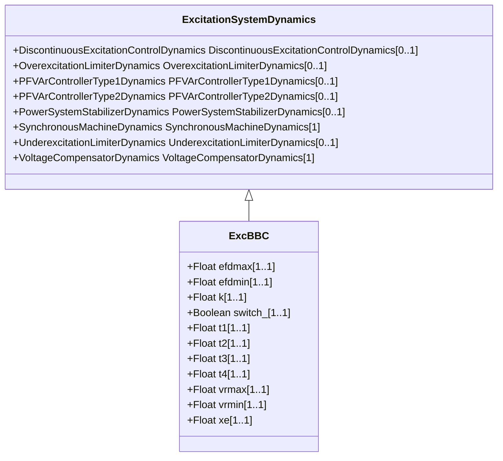

# ExcBBC

Transformer fed static excitation system (static with ABB regulator). This model represents a static excitation system in which a gated thyristor bridge fed by a transformer at the main generator terminals feeds the main generator directly.

## Inheritance

<button class="mermaid-enlarge-button">Enlarge Diagram</button>

## Attributes

| Label | Type | Multiplicity | Comment |
|-------|------|--------------|---------|
| efdmax | Float | 1..1 | Maximum open circuit exciter voltage (Efdmax) (> ExcBBC.efdmin). Typical value = 5. |
| efdmin | Float | 1..1 | Minimum open circuit exciter voltage (Efdmin) (< ExcBBC.efdmax). Typical value = -5. |
| k | Float | 1..1 | Steady state gain (K) (not = 0). Typical value = 300. |
| switch_ | Boolean | 1..1 | Supplementary signal routing selector (switch). true = Vs connected to 3rd summing point false = Vs connected to 1st summing point (see diagram). Typical value = false. |
| t1 | Float | 1..1 | Controller time constant (T1) (>= 0). Typical value = 6. |
| t2 | Float | 1..1 | Controller time constant (T2) (>= 0). Typical value = 1. |
| t3 | Float | 1..1 | Lead/lag time constant (T3) (>= 0). If = 0, block is bypassed. Typical value = 0,05. |
| t4 | Float | 1..1 | Lead/lag time constant (T4) (>= 0). If = 0, block is bypassed. Typical value = 0,01. |
| vrmax | Float | 1..1 | Maximum control element output (Vrmax) (> ExcBBC.vrmin). Typical value = 5. |
| vrmin | Float | 1..1 | Minimum control element output (Vrmin) (< ExcBBC.vrmax). Typical value = -5. |
| xe | Float | 1..1 | Effective excitation transformer reactance (Xe) (>= 0). Xe models the regulation of the transformer/rectifier unit. Typical value = 0,05. |

