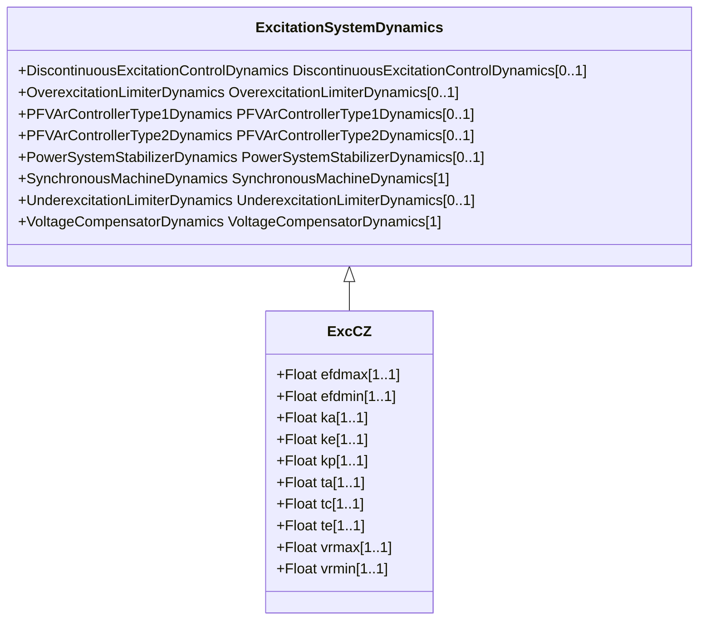

# ExcCZ

Czech proportion/integral exciter.

## Inheritance

<button class="mermaid-enlarge-button">Enlarge Diagram</button>

## Attributes

| Label | Type | Multiplicity | Comment |
|-------|------|--------------|---------|
| efdmax | Float | 1..1 | Exciter output maximum limit (Efdmax) (> ExcCZ.efdmin). |
| efdmin | Float | 1..1 | Exciter output minimum limit (Efdmin) (< ExcCZ.efdmax). |
| ka | Float | 1..1 | Regulator gain (Ka). |
| ke | Float | 1..1 | Exciter constant related to self-excited field (Ke). |
| kp | Float | 1..1 | Regulator proportional gain (Kp). |
| ta | Float | 1..1 | Regulator time constant (Ta) (>= 0). |
| tc | Float | 1..1 | Regulator integral time constant (Tc) (>= 0). |
| te | Float | 1..1 | Exciter time constant, integration rate associated with exciter control (Te) (>= 0). |
| vrmax | Float | 1..1 | Voltage regulator maximum limit (Vrmax) (> ExcCZ.vrmin). |
| vrmin | Float | 1..1 | Voltage regulator minimum limit (Vrmin) (< ExcCZ.vrmax). |

