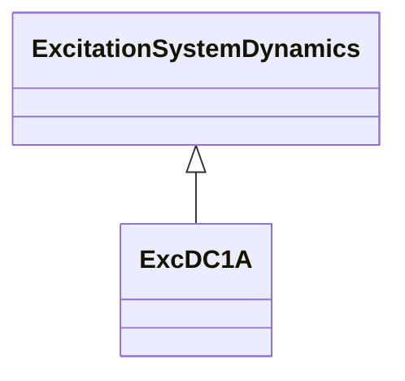

# ExcDC1A

Modified IEEE DC1A direct current commutator exciter with speed input and without underexcitation limiters (UEL) inputs.

## Inheritance

<button class="mermaid-enlarge-button">Enlarge Diagram</button>

## Attributes

| Label | Type | Multiplicity | Comment |
|-------|------|--------------|---------|
| efd1 | Float | 1..1 | Exciter voltage at which exciter saturation is defined (Efd1) (> 0). Typical value = 3,1. |
| efd2 | Float | 1..1 | Exciter voltage at which exciter saturation is defined (Efd2) (> 0). Typical value = 2,3. |
| efdmax | Float | 1..1 | Maximum voltage exciter output limiter (Efdmax) (> ExcDC1A.efdmin). Typical value = 99. |
| efdmin | Float | 1..1 | Minimum voltage exciter output limiter (Efdmin) (< ExcDC1A.edfmax). Typical value = -99. |
| exclim | Boolean | 1..1 | (exclim). IEEE standard is ambiguous about lower limit on exciter output. true = a lower limit of zero is applied to integrator output false = a lower limit of zero is not applied to integrator output. Typical value = true. |
| ka | Float | 1..1 | Voltage regulator gain (Ka) (> 0). Typical value = 46. |
| ke | Float | 1..1 | Exciter constant related to self-excited field (Ke). Typical value = 0. |
| kf | Float | 1..1 | Excitation control system stabilizer gain (Kf) (>= 0). Typical value = 0,1. |
| ks | Float | 1..1 | Coefficient to allow different usage of the model-speed coefficient (Ks). Typical value = 0. |
| seefd1 | Float | 1..1 | Exciter saturation function value at the corresponding exciter voltage, Efd1 (Se[Eefd1]) (>= 0). Typical value = 0,33. |
| seefd2 | Float | 1..1 | Exciter saturation function value at the corresponding exciter voltage, Efd2 (Se[Eefd2]) (>= 0). Typical value = 0,1. |
| ta | Float | 1..1 | Voltage regulator time constant (Ta) (> 0). Typical value = 0,06. |
| tb | Float | 1..1 | Voltage regulator time constant (Tb) (>= 0). Typical value = 0. |
| tc | Float | 1..1 | Voltage regulator time constant (Tc) (>= 0). Typical value = 0. |
| te | Float | 1..1 | Exciter time constant, integration rate associated with exciter control (Te) (> 0). Typical value = 0,46. |
| tf | Float | 1..1 | Excitation control system stabilizer time constant (Tf) (> 0). Typical value = 1. |
| vrmax | Float | 1..1 | Maximum voltage regulator output (Vrmax) (> ExcDC1A.vrmin). Typical value = 1. |
| vrmin | Float | 1..1 | Minimum voltage regulator output (Vrmin) (< 0 and < ExcDC1A.vrmax). Typical value = -0,9. |

