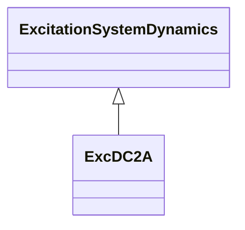

# ExcDC2A

Modified IEEE DC2A direct current commutator exciter with speed input, one more leg block in feedback loop and without underexcitation limiters (UEL) inputs. DC type 2 excitation system model with added speed multiplier, added lead-lag, and voltage-dependent limits.

## Inheritance

<button class="mermaid-enlarge-button">Enlarge Diagram</button>

## Attributes

| Label | Type | Multiplicity | Comment |
|-------|------|--------------|---------|
| efd1 | Float | 1..1 | Exciter voltage at which exciter saturation is defined (Efd1) (> 0). Typical value = 3,05. |
| efd2 | Float | 1..1 | Exciter voltage at which exciter saturation is defined (Efd2) (> 0). Typical value = 2,29. |
| exclim | Boolean | 1..1 | (exclim). IEEE standard is ambiguous about lower limit on exciter output. true = a lower limit of zero is applied to integrator output false = a lower limit of zero is not applied to integrator output. Typical value = true. |
| ka | Float | 1..1 | Voltage regulator gain (Ka) (> 0). Typical value = 300. |
| ke | Float | 1..1 | Exciter constant related to self-excited field (Ke). If Ke is entered as zero, the model calculates an effective value of Ke such that the initial condition value of Vr is zero. The zero value of Ke is not changed. If Ke is entered as non-zero, its value is used directly, without change. Typical value = 1. |
| kf | Float | 1..1 | Excitation control system stabilizer gain (Kf) (>= 0). Typical value = 0,1. |
| ks | Float | 1..1 | Coefficient to allow different usage of the model-speed coefficient (Ks). Typical value = 0. |
| seefd1 | Float | 1..1 | Exciter saturation function value at the corresponding exciter voltage, Efd1 (Se[Efd1]) (>= 0). Typical value = 0,279. |
| seefd2 | Float | 1..1 | Exciter saturation function value at the corresponding exciter voltage, Efd2 (Se[Efd2]) (>= 0). Typical value = 0,117. |
| ta | Float | 1..1 | Voltage regulator time constant (Ta) (> 0). Typical value = 0,01. |
| tb | Float | 1..1 | Voltage regulator time constant (Tb) (>= 0). Typical value = 0. |
| tc | Float | 1..1 | Voltage regulator time constant (Tc) (>= 0). Typical value = 0. |
| te | Float | 1..1 | Exciter time constant, integration rate associated with exciter control (Te) (> 0). Typical value = 1,33. |
| tf | Float | 1..1 | Excitation control system stabilizer time constant (Tf) (> 0). Typical value = 0,675. |
| tf1 | Float | 1..1 | Excitation control system stabilizer time constant (Tf1) (>= 0). Typical value = 0. |
| vrmax | Float | 1..1 | Maximum voltage regulator output (Vrmax) (> ExcDC2A.vrmin). Typical value = 4,95. |
| vrmin | Float | 1..1 | Minimum voltage regulator output (Vrmin) (< 0 and < ExcDC2A.vrmax). Typical value = -4,9. |
| vtlim | Boolean | 1..1 | (Vtlim). true = limiter at the block (Ka / [1 + sTa]) is dependent on Vt false = limiter at the block is not dependent on Vt. Typical value = true. |

