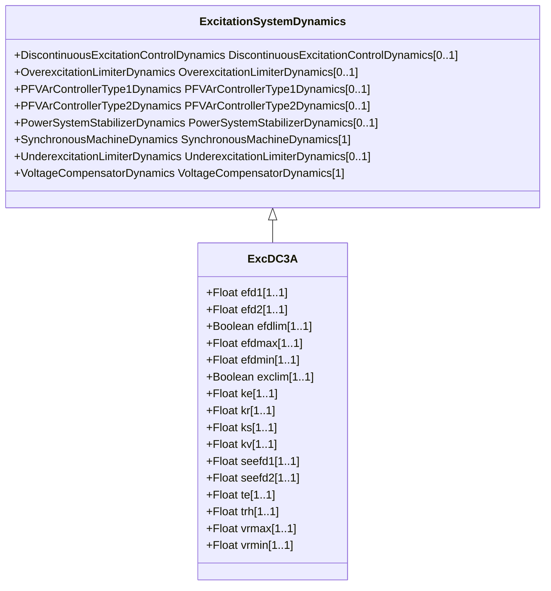

# ExcDC3A

Modified IEEE DC3A direct current commutator exciter with speed input, and deadband. DC old type 4.

## Inheritance

<button class="mermaid-enlarge-button">Enlarge Diagram</button>

## Attributes

| Label | Type | Multiplicity | Comment |
|-------|------|--------------|---------|
| efd1 | Float | 1..1 | Exciter voltage at which exciter saturation is defined (Efd1) (> 0). Typical value = 2,6. |
| efd2 | Float | 1..1 | Exciter voltage at which exciter saturation is defined (Efd2) (> 0). Typical value = 3,45. |
| efdlim | Boolean | 1..1 | (Efdlim). true = exciter output limiter is active false = exciter output limiter not active. Typical value = true. |
| efdmax | Float | 1..1 | Maximum voltage exciter output limiter (Efdmax) (> ExcDC3A.efdmin). Typical value = 99. |
| efdmin | Float | 1..1 | Minimum voltage exciter output limiter (Efdmin) (< ExcDC3A.efdmax). Typical value = -99. |
| exclim | Boolean | 1..1 | (exclim). IEEE standard is ambiguous about lower limit on exciter output. true = a lower limit of zero is applied to integrator output false = a lower limit of zero not applied to integrator output. Typical value = true. |
| ke | Float | 1..1 | Exciter constant related to self-excited field (Ke). Typical value = 1. |
| kr | Float | 1..1 | Deadband (Kr). Typical value = 0. |
| ks | Float | 1..1 | Coefficient to allow different usage of the model-speed coefficient (Ks). Typical value = 0. |
| kv | Float | 1..1 | Fast raise/lower contact setting (Kv) (> 0). Typical value = 0,05. |
| seefd1 | Float | 1..1 | Exciter saturation function value at the corresponding exciter voltage, Efd1 (Se[Efd1]) (>= 0). Typical value = 0,1. |
| seefd2 | Float | 1..1 | Exciter saturation function value at the corresponding exciter voltage, Efd2 (Se[Efd2]) (>= 0). Typical value = 0,35. |
| te | Float | 1..1 | Exciter time constant, integration rate associated with exciter control (Te) (> 0). Typical value = 1,83. |
| trh | Float | 1..1 | Rheostat travel time (Trh) (> 0). Typical value = 20. |
| vrmax | Float | 1..1 | Maximum voltage regulator output (Vrmax) (> 0). Typical value = 5. |
| vrmin | Float | 1..1 | Minimum voltage regulator output (Vrmin) (<= 0). Typical value = 0. |

