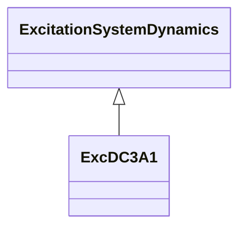

# ExcDC3A1

Modified old IEEE type 3 excitation system.

## Inheritance

<button class="mermaid-enlarge-button">Enlarge Diagram</button>

## Attributes

| Label | Type | Multiplicity | Comment |
|-------|------|--------------|---------|
| exclim | Boolean | 1..1 | (exclim). true = lower limit of zero is applied to integrator output false = lower limit of zero not applied to integrator output. Typical value = true. |
| ka | Float | 1..1 | Voltage regulator gain (Ka) (> 0). Typical value = 300. |
| ke | Float | 1..1 | Exciter constant related to self-excited field (Ke). Typical value = 1. |
| kf | Float | 1..1 | Excitation control system stabilizer gain (Kf) (>= 0). Typical value = 0,1. |
| ki | Float | 1..1 | Potential circuit gain coefficient (Ki) (>= 0). Typical value = 4,83. |
| kp | Float | 1..1 | Potential circuit gain coefficient (Kp) (>= 0). Typical value = 4,37. |
| ta | Float | 1..1 | Voltage regulator time constant (Ta) (> 0). Typical value = 0,01. |
| te | Float | 1..1 | Exciter time constant, integration rate associated with exciter control (Te) (> 0). Typical value = 1,83. |
| tf | Float | 1..1 | Excitation control system stabilizer time constant (Tf) (>= 0). Typical value = 0,675. |
| vb1max | Float | 1..1 | Available exciter voltage limiter (Vb1max) (> 0). Typical value = 11,63. |
| vblim | Boolean | 1..1 | Vb limiter indicator. true = exciter Vbmax limiter is active false = Vb1max is active. Typical value = true. |
| vbmax | Float | 1..1 | Available exciter voltage limiter (Vbmax) (> 0). Typical value = 11,63. |
| vrmax | Float | 1..1 | Maximum voltage regulator output (Vrmax) (> ExcDC3A1.vrmin). Typical value = 5. |
| vrmin | Float | 1..1 | Minimum voltage regulator output (Vrmin) (< 0 and < ExcDC3A1.vrmax). Typical value = 0. |

