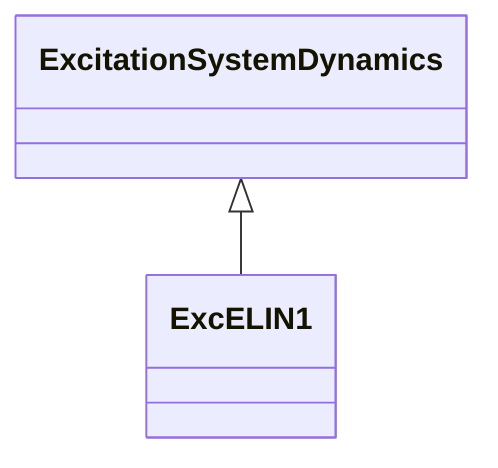

# ExcELIN1

Static PI transformer fed excitation system ELIN (VATECH) - simplified model. This model represents an all-static excitation system. A PI voltage controller establishes a desired field current set point for a proportional current controller. The integrator of the PI controller has a follow-up input to match its signal to the present field current. A power system stabilizer with power input is included in the model.

## Inheritance

<button class="mermaid-enlarge-button">Enlarge Diagram</button>

## Attributes

| Label | Type | Multiplicity | Comment |
|-------|------|--------------|---------|
| dpnf | Float | 1..1 | Controller follow up deadband (Dpnf). Typical value = 0. |
| efmax | Float | 1..1 | Maximum open circuit excitation voltage (Efmax) (> ExcELIN1.efmin). Typical value = 5. |
| efmin | Float | 1..1 | Minimum open circuit excitation voltage (Efmin) (< ExcELIN1.efmax). Typical value = -5. |
| ks1 | Float | 1..1 | Stabilizer gain 1 (Ks1). Typical value = 0. |
| ks2 | Float | 1..1 | Stabilizer gain 2 (Ks2). Typical value = 0. |
| smax | Float | 1..1 | Stabilizer limit output (smax). Typical value = 0,1. |
| tfi | Float | 1..1 | Current transducer time constant (Tfi) (>= 0). Typical value = 0. |
| tnu | Float | 1..1 | Controller reset time constant (Tnu) (>= 0). Typical value = 2. |
| ts1 | Float | 1..1 | Stabilizer phase lag time constant (Ts1) (>= 0). Typical value = 1. |
| ts2 | Float | 1..1 | Stabilizer filter time constant (Ts2) (>= 0). Typical value = 1. |
| tsw | Float | 1..1 | Stabilizer parameters (Tsw) (>= 0). Typical value = 3. |
| vpi | Float | 1..1 | Current controller gain (Vpi). Typical value = 12,45. |
| vpnf | Float | 1..1 | Controller follow up gain (Vpnf). Typical value = 2. |
| vpu | Float | 1..1 | Voltage controller proportional gain (Vpu). Typical value = 34,5. |
| xe | Float | 1..1 | Excitation transformer effective reactance (Xe) (>= 0). Xe represents the regulation of the transformer/rectifier unit. Typical value = 0,06. |

