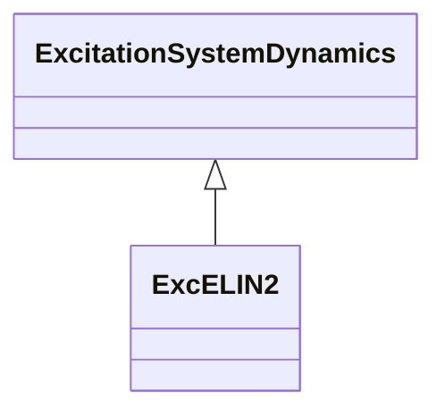

# ExcELIN2

Detailed excitation system ELIN (VATECH). This model represents an all-static excitation system. A PI voltage controller establishes a desired field current set point for a proportional current controller. The integrator of the PI controller has a follow-up input to match its signal to the present field current. Power system stabilizer models used in conjunction with this excitation system model: PssELIN2, PssIEEE2B, Pss2B.

## Inheritance

<button class="mermaid-enlarge-button">Enlarge Diagram</button>

## Attributes

| Label | Type | Multiplicity | Comment |
|-------|------|--------------|---------|
| efdbas | Float | 1..1 | Gain (Efdbas). Typical value = 0,1. |
| iefmax | Float | 1..1 | Limiter (Iefmax) (> ExcELIN2.iefmin). Typical value = 1. |
| iefmax2 | Float | 1..1 | Minimum open circuit excitation voltage (Iefmax2). Typical value = -5. |
| iefmin | Float | 1..1 | Limiter (Iefmin) (< ExcELIN2.iefmax). Typical value = 1. |
| k1 | Float | 1..1 | Voltage regulator input gain (K1). Typical value = 0. |
| k1ec | Float | 1..1 | Voltage regulator input limit (K1ec). Typical value = 2. |
| k2 | Float | 1..1 | Gain (K2). Typical value = 5. |
| k3 | Float | 1..1 | Gain (K3). Typical value = 0,1. |
| k4 | Float | 1..1 | Gain (K4). Typical value = 0. |
| kd1 | Float | 1..1 | Voltage controller derivative gain (Kd1). Typical value = 34,5. |
| ke2 | Float | 1..1 | Gain (Ke2). Typical value = 0,1. |
| ketb | Float | 1..1 | Gain (Ketb). Typical value = 0,06. |
| pid1max | Float | 1..1 | Controller follow up gain (PID1max). Typical value = 2. |
| seve1 | Float | 1..1 | Exciter saturation function value at the corresponding exciter voltage, Ve1, back of commutating reactance (Se[Ve1]) (>= 0). Typical value = 0. |
| seve2 | Float | 1..1 | Exciter saturation function value at the corresponding exciter voltage, Ve2, back of commutating reactance (Se[Ve2]) (>= 0). Typical value = 1. |
| tb1 | Float | 1..1 | Voltage controller derivative washout time constant (Tb1) (>= 0). Typical value = 12,45. |
| te | Float | 1..1 | Time constant (Te) (>= 0). Typical value = 0. |
| te2 | Float | 1..1 | Time Constant (Te2) (>= 0). Typical value = 1. |
| ti1 | Float | 1..1 | Controller follow up deadband (Ti1). Typical value = 0. |
| ti3 | Float | 1..1 | Time constant (Ti3) (>= 0). Typical value = 3. |
| ti4 | Float | 1..1 | Time constant (Ti4) (>= 0). Typical value = 0. |
| tr4 | Float | 1..1 | Time constant (Tr4) (>= 0). Typical value = 1. |
| upmax | Float | 1..1 | Limiter (Upmax) (> ExcELIN2.upmin). Typical value = 3. |
| upmin | Float | 1..1 | Limiter (Upmin) (< ExcELIN2.upmax). Typical value = 0. |
| ve1 | Float | 1..1 | Exciter alternator output voltages back of commutating reactance at which saturation is defined (Ve1) (> 0). Typical value = 3. |
| ve2 | Float | 1..1 | Exciter alternator output voltages back of commutating reactance at which saturation is defined (Ve2) (> 0). Typical value = 0. |
| xp | Float | 1..1 | Excitation transformer effective reactance (Xp). Typical value = 1. |

