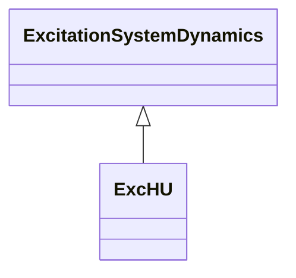

# ExcHU

Hungarian excitation system, with built-in voltage transducer.

## Inheritance

<button class="mermaid-enlarge-button">Enlarge Diagram</button>

## Attributes

| Label | Type | Multiplicity | Comment |
|-------|------|--------------|---------|
| ae | Float | 1..1 | Major loop PI tag gain factor (Ae). Typical value = 3. |
| ai | Float | 1..1 | Minor loop PI tag gain factor (Ai). Typical value = 22. |
| atr | Float | 1..1 | AVR constant (Atr). Typical value = 2,19. |
| emax | Float | 1..1 | Field voltage control signal upper limit on AVR base (Emax) (> ExcHU.emin). Typical value = 0,996. |
| emin | Float | 1..1 | Field voltage control signal lower limit on AVR base (Emin) (< ExcHU.emax). Typical value = -0,866. |
| imax | Float | 1..1 | Major loop PI tag output signal upper limit (Imax) (> ExcHU.imin). Typical value = 2,19. |
| imin | Float | 1..1 | Major loop PI tag output signal lower limit (Imin) (< ExcHU.imax). Typical value = 0,1. |
| ke | Float | 1..1 | Voltage base conversion constant (Ke). Typical value = 4,666. |
| ki | Float | 1..1 | Current base conversion constant (Ki). Typical value = 0,21428. |
| te | Float | 1..1 | Major loop PI tag integration time constant (Te) (>= 0). Typical value = 0,154. |
| ti | Float | 1..1 | Minor loop PI control tag integration time constant (Ti) (>= 0). Typical value = 0,01333. |
| tr | Float | 1..1 | Filter time constant (Tr) (>= 0). If a voltage compensator is used in conjunction with this excitation system model, Tr should be set to 0. Typical value = 0,01. |

