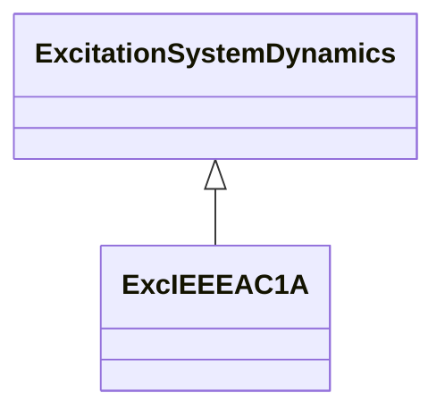

# ExcIEEEAC1A

IEEE 421.5-2005 type AC1A model. The model represents the field-controlled alternator-rectifier excitation systems designated type AC1A. These excitation systems consist of an alternator main exciter with non-controlled rectifiers. Reference: IEEE 421.5-2005, 6.1.

## Inheritance

<button class="mermaid-enlarge-button">Enlarge Diagram</button>

## Attributes

| Label | Type | Multiplicity | Comment |
|-------|------|--------------|---------|
| ka | Float | 1..1 | Voltage regulator gain (KA) (> 0). Typical value = 400. |
| kc | Float | 1..1 | Rectifier loading factor proportional to commutating reactance (KC) (>= 0). Typical value = 0,2. |
| kd | Float | 1..1 | Demagnetizing factor, a function of exciter alternator reactances (KD) (>= 0). Typical value = 0,38. |
| ke | Float | 1..1 | Exciter constant related to self-excited field (KE). Typical value = 1. |
| kf | Float | 1..1 | Excitation control system stabilizer gains (KF) (>= 0). Typical value = 0,03. |
| seve1 | Float | 1..1 | Exciter saturation function value at the corresponding exciter voltage, VE1, back of commutating reactance (SE[VE1]) (>= 0). Typical value = 0,1. |
| seve2 | Float | 1..1 | Exciter saturation function value at the corresponding exciter voltage, VE2, back of commutating reactance (SE[VE2]) (>= 0). Typical value = 0,03. |
| ta | Float | 1..1 | Voltage regulator time constant (TA) (> 0). Typical value = 0,02. |
| tb | Float | 1..1 | Voltage regulator time constant (TB) (>= 0). Typical value = 0. |
| tc | Float | 1..1 | Voltage regulator time constant (TC) (>= 0). Typical value = 0. |
| te | Float | 1..1 | Exciter time constant, integration rate associated with exciter control (TE) (> 0). Typical value = 0,8. |
| tf | Float | 1..1 | Excitation control system stabilizer time constant (TF) (> 0). Typical value = 1. |
| vamax | Float | 1..1 | Maximum voltage regulator output (VAMAX) (> 0). Typical value = 14,5. |
| vamin | Float | 1..1 | Minimum voltage regulator output (VAMIN) (< 0). Typical value = -14,5. |
| ve1 | Float | 1..1 | Exciter alternator output voltages back of commutating reactance at which saturation is defined (VE1) (> 0). Typical value = 4,18. |
| ve2 | Float | 1..1 | Exciter alternator output voltages back of commutating reactance at which saturation is defined (VE2) (> 0). Typical value = 3,14. |
| vrmax | Float | 1..1 | Maximum voltage regulator outputs (VRMAX) (> 0). Typical value = 6,03. |
| vrmin | Float | 1..1 | Minimum voltage regulator outputs (VRMIN) (< 0). Typical value = -5,43. |

