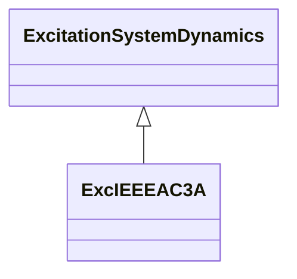

# ExcIEEEAC3A

IEEE 421.5-2005 type AC3A model. The model represents the field-controlled alternator-rectifier excitation systems designated type AC3A. These excitation systems include an alternator main exciter with non-controlled rectifiers. The exciter employs self-excitation, and the voltage regulator power is derived from the exciter output voltage. Therefore, this system has an additional nonlinearity, simulated by the use of a multiplier whose inputs are the voltage regulator command signal, Va, and the exciter output voltage, Efd, times KR. This model is applicable to excitation systems employing static voltage regulators. Reference: IEEE 421.5-2005, 6.3.

## Inheritance

<button class="mermaid-enlarge-button">Enlarge Diagram</button>

## Attributes

| Label | Type | Multiplicity | Comment |
|-------|------|--------------|---------|
| efdn | Float | 1..1 | Value of Efd at which feedback gain changes (EFDN) (> 0). Typical value = 2,36. |
| ka | Float | 1..1 | Voltage regulator gain (KA) (> 0). Typical value = 45,62. |
| kc | Float | 1..1 | Rectifier loading factor proportional to commutating reactance (KC) (>= 0). Typical value = 0,104. |
| kd | Float | 1..1 | Demagnetizing factor, a function of exciter alternator reactances (KD) (>= 0). Typical value = 0,499. |
| ke | Float | 1..1 | Exciter constant related to self-excited field (KE). Typical value = 1. |
| kf | Float | 1..1 | Excitation control system stabilizer gains (KF) (>= 0). Typical value = 0,143. |
| kn | Float | 1..1 | Excitation control system stabilizer gain (KN) (>= 0). Typical value = 0,05. |
| kr | Float | 1..1 | Constant associated with regulator and alternator field power supply (KR) (> 0). Typical value = 3,77. |
| seve1 | Float | 1..1 | Exciter saturation function value at the corresponding exciter voltage, VE1, back of commutating reactance (SE[VE1]) (>= 0). Typical value = 1,143. |
| seve2 | Float | 1..1 | Exciter saturation function value at the corresponding exciter voltage, VE2, back of commutating reactance (SE[VE2]) (>= 0). Typical value = 0,1. |
| ta | Float | 1..1 | Voltage regulator time constant (TA) (> 0). Typical value = 0,013. |
| tb | Float | 1..1 | Voltage regulator time constant (TB) (>= 0). Typical value = 0. |
| tc | Float | 1..1 | Voltage regulator time constant (TC) (>= 0). Typical value = 0. |
| te | Float | 1..1 | Exciter time constant, integration rate associated with exciter control (TE) (> 0). Typical value = 1,17. |
| tf | Float | 1..1 | Excitation control system stabilizer time constant (TF) (> 0). Typical value = 1. |
| vamax | Float | 1..1 | Maximum voltage regulator output (VAMAX) (> 0). Typical value = 1. |
| vamin | Float | 1..1 | Minimum voltage regulator output (VAMIN) (< 0). Typical value = -0,95. |
| ve1 | Float | 1..1 | Exciter alternator output voltages back of commutating reactance at which saturation is defined (VE1) (> 0). Typical value = 6,24. |
| ve2 | Float | 1..1 | Exciter alternator output voltages back of commutating reactance at which saturation is defined (VE2) (> 0). Typical value = 4,68. |
| vemin | Float | 1..1 | Minimum exciter voltage output (VEMIN) (<= 0). Typical value = 0. |
| vfemax | Float | 1..1 | Exciter field current limit reference (VFEMAX) (>= 0). Typical value = 16. |

