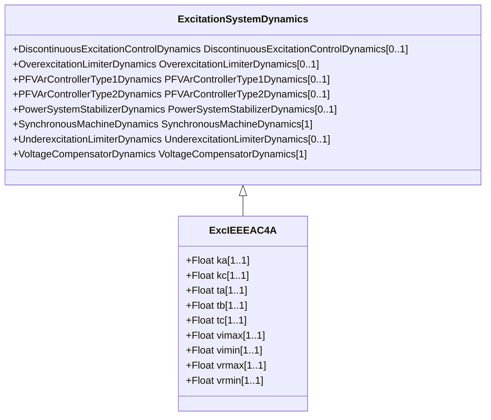

# ExcIEEEAC4A

IEEE 421.5-2005 type AC4A model. The model represents type AC4A alternator-supplied controlled-rectifier excitation system which is quite different from the other types of AC systems. This high initial response excitation system utilizes a full thyristor bridge in the exciter output circuit. The voltage regulator controls the firing of the thyristor bridges. The exciter alternator uses an independent voltage regulator to control its output voltage to a constant value. These effects are not modelled; however, transient loading effects on the exciter alternator are included. Reference: IEEE 421.5-2005, 6.4.

## Inheritance

<button class="mermaid-enlarge-button">Enlarge Diagram</button>

## Attributes

| Label | Type | Multiplicity | Comment |
|-------|------|--------------|---------|
| ka | Float | 1..1 | Voltage regulator gain (KA) (> 0). Typical value = 200. |
| kc | Float | 1..1 | Rectifier loading factor proportional to commutating reactance (KC) (>= 0). Typical value = 0. |
| ta | Float | 1..1 | Voltage regulator time constant (TA) (> 0). Typical value = 0,015. |
| tb | Float | 1..1 | Voltage regulator time constant (TB) (>= 0). Typical value = 10. |
| tc | Float | 1..1 | Voltage regulator time constant (TC) (>= 0). Typical value = 1. |
| vimax | Float | 1..1 | Maximum voltage regulator input limit (VIMAX) (> 0). Typical value = 10. |
| vimin | Float | 1..1 | Minimum voltage regulator input limit (VIMIN) (< 0). Typical value = -10. |
| vrmax | Float | 1..1 | Maximum voltage regulator output (VRMAX) (> 0). Typical value = 5,64. |
| vrmin | Float | 1..1 | Minimum voltage regulator output (VRMIN) (< 0). Typical value = -4,53. |

