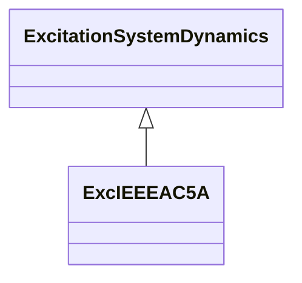

# ExcIEEEAC5A

IEEE 421.5-2005 type AC5A model. The model represents a simplified model for brushless excitation systems. The regulator is supplied from a source, such as a permanent magnet generator, which is not affected by system disturbances. Unlike other AC models, this model uses loaded rather than open circuit exciter saturation data in the same way as it is used for the DC models. Because the model has been widely implemented by the industry, it is sometimes used to represent other types of systems when either detailed data for them are not available or simplified models are required. Reference: IEEE 421.5-2005, 6.5.

## Inheritance

<button class="mermaid-enlarge-button">Enlarge Diagram</button>

## Attributes

| Label | Type | Multiplicity | Comment |
|-------|------|--------------|---------|
| efd1 | Float | 1..1 | Exciter voltage at which exciter saturation is defined (EFD1) (> 0). Typical value = 5,6. |
| efd2 | Float | 1..1 | Exciter voltage at which exciter saturation is defined (EFD2) (> 0). Typical value = 4,2. |
| ka | Float | 1..1 | Voltage regulator gain (KA) (> 0). Typical value = 400. |
| ke | Float | 1..1 | Exciter constant related to self-excited field (KE). Typical value = 1. |
| kf | Float | 1..1 | Excitation control system stabilizer gains (KF) (>= 0). Typical value = 0,03. |
| seefd1 | Float | 1..1 | Exciter saturation function value at the corresponding exciter voltage, EFD1 (SE[EFD1]) (>= 0). Typical value = 0,86. |
| seefd2 | Float | 1..1 | Exciter saturation function value at the corresponding exciter voltage, EFD2 (SE[EFD2]) (>= 0). Typical value = 0,5. |
| ta | Float | 1..1 | Voltage regulator time constant (TA) (> 0). Typical value = 0,02. |
| te | Float | 1..1 | Exciter time constant, integration rate associated with exciter control (TE) (> 0). Typical value = 0,8. |
| tf1 | Float | 1..1 | Excitation control system stabilizer time constant (TF1) (> 0). Typical value = 1. |
| tf2 | Float | 1..1 | Excitation control system stabilizer time constant (TF2) (>= 0). Typical value = 1. |
| tf3 | Float | 1..1 | Excitation control system stabilizer time constant (TF3) (>= 0). Typical value = 1. |
| vrmax | Float | 1..1 | Maximum voltage regulator output (VRMAX) (> 0). Typical value = 7,3. |
| vrmin | Float | 1..1 | Minimum voltage regulator output (VRMIN) (< 0). Typical value = -7,3. |

