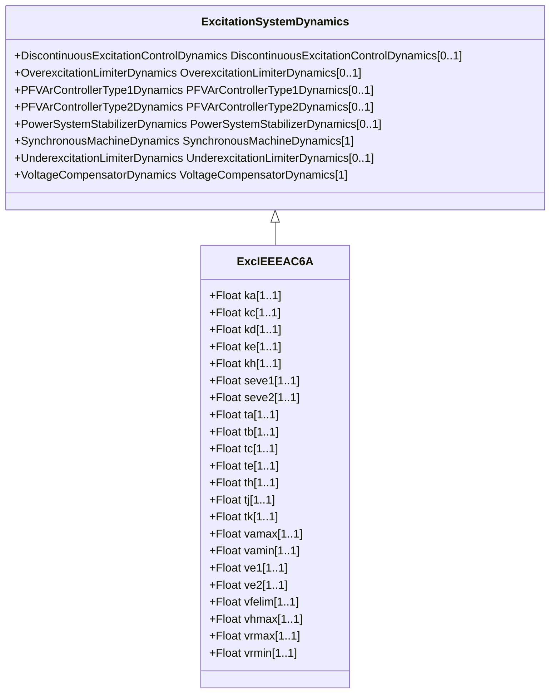

# ExcIEEEAC6A

IEEE 421.5-2005 type AC6A model. The model represents field-controlled alternator-rectifier excitation systems with system-supplied electronic voltage regulators. The maximum output of the regulator, VR, is a function of terminal voltage, VT. The field current limiter included in the original model AC6A remains in the 2005 update. Reference: IEEE 421.5-2005, 6.6.

## Inheritance

<button class="mermaid-enlarge-button">Enlarge Diagram</button>

## Attributes

| Label | Type | Multiplicity | Comment |
|-------|------|--------------|---------|
| ka | Float | 1..1 | Voltage regulator gain (KA) (> 0). Typical value = 536. |
| kc | Float | 1..1 | Rectifier loading factor proportional to commutating reactance (KC) (>= 0). Typical value = 0,173. |
| kd | Float | 1..1 | Demagnetizing factor, a function of exciter alternator reactances (KD) (>= 0). Typical value = 1,91. |
| ke | Float | 1..1 | Exciter constant related to self-excited field (KE). Typical value = 1,6. |
| kh | Float | 1..1 | Exciter field current limiter gain (KH) (>= 0). Typical value = 92. |
| seve1 | Float | 1..1 | Exciter saturation function value at the corresponding exciter voltage, VE1, back of commutating reactance (SE[VE1]) (>= 0). Typical value = 0,214. |
| seve2 | Float | 1..1 | Exciter saturation function value at the corresponding exciter voltage, VE2, back of commutating reactance (SE[VE2]) (>= 0). Typical value = 0,044. |
| ta | Float | 1..1 | Voltage regulator time constant (TA) (>= 0). Typical value = 0,086. |
| tb | Float | 1..1 | Voltage regulator time constant (TB) (>= 0). Typical value = 9. |
| tc | Float | 1..1 | Voltage regulator time constant (TC) (>= 0). Typical value = 3. |
| te | Float | 1..1 | Exciter time constant, integration rate associated with exciter control (TE) (> 0). Typical value = 1. |
| th | Float | 1..1 | Exciter field current limiter time constant (TH) (> 0). Typical value = 0,08. |
| tj | Float | 1..1 | Exciter field current limiter time constant (TJ) (>= 0). Typical value = 0,02. |
| tk | Float | 1..1 | Voltage regulator time constant (TK) (>= 0). Typical value = 0,18. |
| vamax | Float | 1..1 | Maximum voltage regulator output (VAMAX) (> 0). Typical value = 75. |
| vamin | Float | 1..1 | Minimum voltage regulator output (VAMIN) (< 0). Typical value = -75. |
| ve1 | Float | 1..1 | Exciter alternator output voltages back of commutating reactance at which saturation is defined (VE1) (> 0). Typical value = 7,4. |
| ve2 | Float | 1..1 | Exciter alternator output voltages back of commutating reactance at which saturation is defined (VE2) (> 0). Typical value = 5,55. |
| vfelim | Float | 1..1 | Exciter field current limit reference (VFELIM) (> 0). Typical value = 19. |
| vhmax | Float | 1..1 | Maximum field current limiter signal reference (VHMAX) (> 0). Typical value = 75. |
| vrmax | Float | 1..1 | Maximum voltage regulator output (VRMAX) (> 0). Typical value = 44. |
| vrmin | Float | 1..1 | Minimum voltage regulator output (VRMIN) (< 0). Typical value = -36. |

