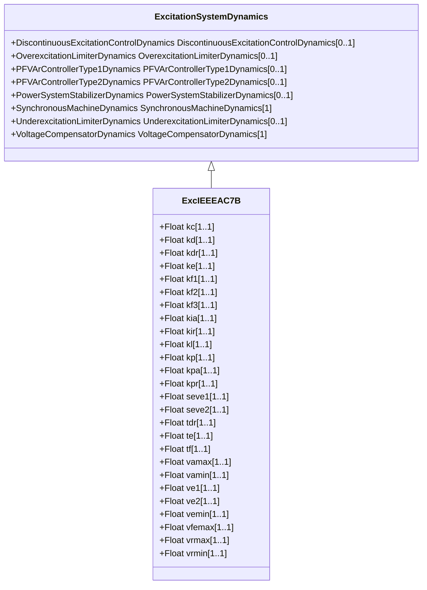

# ExcIEEEAC7B

IEEE 421.5-2005 type AC7B model. The model represents excitation systems which consist of an AC alternator with either stationary or rotating rectifiers to produce the DC field requirements. It is an upgrade to earlier AC excitation systems, which replace only the controls but retain the AC alternator and diode rectifier bridge. Reference: IEEE 421.5-2005, 6.7. Note, however, that in IEEE 421.5-2005, the [1 / sTE] block is shown as [1 / (1 + sTE)], which is incorrect.

## Inheritance

<button class="mermaid-enlarge-button">Enlarge Diagram</button>

## Attributes

| Label | Type | Multiplicity | Comment |
|-------|------|--------------|---------|
| kc | Float | 1..1 | Rectifier loading factor proportional to commutating reactance (KC) (>= 0). Typical value = 0,18. |
| kd | Float | 1..1 | Demagnetizing factor, a function of exciter alternator reactances (KD) (>= 0). Typical value = 0,02. |
| kdr | Float | 1..1 | Voltage regulator derivative gain (KDR) (>= 0). Typical value = 0. |
| ke | Float | 1..1 | Exciter constant related to self-excited field (KE). Typical value = 1. |
| kf1 | Float | 1..1 | Excitation control system stabilizer gain (KF1) (>= 0). Typical value = 0,212. |
| kf2 | Float | 1..1 | Excitation control system stabilizer gain (KF2) (>= 0). Typical value = 0. |
| kf3 | Float | 1..1 | Excitation control system stabilizer gain (KF3) (>= 0). Typical value = 0. |
| kia | Float | 1..1 | Voltage regulator integral gain (KIA) (>= 0). Typical value = 59,69. |
| kir | Float | 1..1 | Voltage regulator integral gain (KIR) (>= 0). Typical value = 4,24. |
| kl | Float | 1..1 | Exciter field voltage lower limit parameter (KL). Typical value = 10. |
| kp | Float | 1..1 | Potential circuit gain coefficient (KP) (> 0). Typical value = 4,96. |
| kpa | Float | 1..1 | Voltage regulator proportional gain (KPA) (> 0 if ExcIEEEAC7B.kia = 0). Typical value = 65,36. |
| kpr | Float | 1..1 | Voltage regulator proportional gain (KPR) (> 0 if ExcIEEEAC7B.kir = 0). Typical value = 4,24. |
| seve1 | Float | 1..1 | Exciter saturation function value at the corresponding exciter voltage, VE1, back of commutating reactance (SE[VE1]) (>= 0). Typical value = 0,44. |
| seve2 | Float | 1..1 | Exciter saturation function value at the corresponding exciter voltage, VE2, back of commutating reactance (SE[VE2]) (>= 0). Typical value = 0,075. |
| tdr | Float | 1..1 | Lag time constant (TDR) (>= 0). Typical value = 0. |
| te | Float | 1..1 | Exciter time constant, integration rate associated with exciter control (TE) (> 0). Typical value = 1,1. |
| tf | Float | 1..1 | Excitation control system stabilizer time constant (TF) (> 0). Typical value = 1. |
| vamax | Float | 1..1 | Maximum voltage regulator output (VAMAX) (> 0). Typical value = 1. |
| vamin | Float | 1..1 | Minimum voltage regulator output (VAMIN) (< 0). Typical value = -0,95. |
| ve1 | Float | 1..1 | Exciter alternator output voltages back of commutating reactance at which saturation is defined (VE1) (> 0). Typical value = 6,3. |
| ve2 | Float | 1..1 | Exciter alternator output voltages back of commutating reactance at which saturation is defined (VE2) (> 0). Typical value = 3,02. |
| vemin | Float | 1..1 | Minimum exciter voltage output (VEMIN) (<= 0). Typical value = 0. |
| vfemax | Float | 1..1 | Exciter field current limit reference (VFEMAX). Typical value = 6,9. |
| vrmax | Float | 1..1 | Maximum voltage regulator output (VRMAX) (> 0). Typical value = 5,79. |
| vrmin | Float | 1..1 | Minimum voltage regulator output (VRMIN) (< 0). Typical value = -5,79. |

