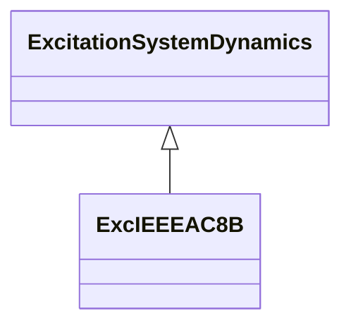

# ExcIEEEAC8B

IEEE 421.5-2005 type AC8B model. This model represents a PID voltage regulator with either a brushless exciter or DC exciter. The AVR in this model consists of PID control, with separate constants for the proportional (KPR), integral (KIR), and derivative (KDR) gains. The representation of the brushless exciter (TE, KE, SE, KC, KD) is similar to the model type AC2A. The type AC8B model can be used to represent static voltage regulators applied to brushless excitation systems. Digitally based voltage regulators feeding DC rotating main exciters can be represented with the AC type AC8B model with the parameters KC and KD set to 0. For thyristor power stages fed from the generator terminals, the limits VRMAX and VRMIN should be a function of terminal voltage: VT x VRMAX and VT x VRMIN. Reference: IEEE 421.5-2005, 6.8.

## Inheritance

<button class="mermaid-enlarge-button">Enlarge Diagram</button>

## Attributes

| Label | Type | Multiplicity | Comment |
|-------|------|--------------|---------|
| ka | Float | 1..1 | Voltage regulator gain (KA) (> 0). Typical value = 1. |
| kc | Float | 1..1 | Rectifier loading factor proportional to commutating reactance (KC) (>= 0). Typical value = 0,55. |
| kd | Float | 1..1 | Demagnetizing factor, a function of exciter alternator reactances (KD) (>= 0). Typical value = 1,1. |
| kdr | Float | 1..1 | Voltage regulator derivative gain (KDR) (>= 0). Typical value = 10. |
| ke | Float | 1..1 | Exciter constant related to self-excited field (KE). Typical value = 1. |
| kir | Float | 1..1 | Voltage regulator integral gain (KIR) (>= 0). Typical value = 5. |
| kpr | Float | 1..1 | Voltage regulator proportional gain (KPR) (> 0 if ExcIEEEAC8B.kir = 0). Typical value = 80. |
| seve1 | Float | 1..1 | Exciter saturation function value at the corresponding exciter voltage, VE1, back of commutating reactance (SE[VE1]) (>= 0). Typical value = 0,3. |
| seve2 | Float | 1..1 | Exciter saturation function value at the corresponding exciter voltage, VE2, back of commutating reactance (SE[VE2]) (>= 0). Typical value = 3. |
| ta | Float | 1..1 | Voltage regulator time constant (TA) (>= 0). Typical value = 0. |
| tdr | Float | 1..1 | Lag time constant (TDR) (> 0). Typical value = 0,1. |
| te | Float | 1..1 | Exciter time constant, integration rate associated with exciter control (TE) (> 0). Typical value = 1,2. |
| ve1 | Float | 1..1 | Exciter alternator output voltages back of commutating reactance at which saturation is defined (VE1) (> 0). Typical value = 6,5. |
| ve2 | Float | 1..1 | Exciter alternator output voltages back of commutating reactance at which saturation is defined (VE2) (> 0). Typical value = 9. |
| vemin | Float | 1..1 | Minimum exciter voltage output (VEMIN) (<= 0). Typical value = 0. |
| vfemax | Float | 1..1 | Exciter field current limit reference (VFEMAX). Typical value = 6. |
| vrmax | Float | 1..1 | Maximum voltage regulator output (VRMAX) (> 0). Typical value = 35. |
| vrmin | Float | 1..1 | Minimum voltage regulator output (VRMIN) (<= 0). Typical value = 0. |

