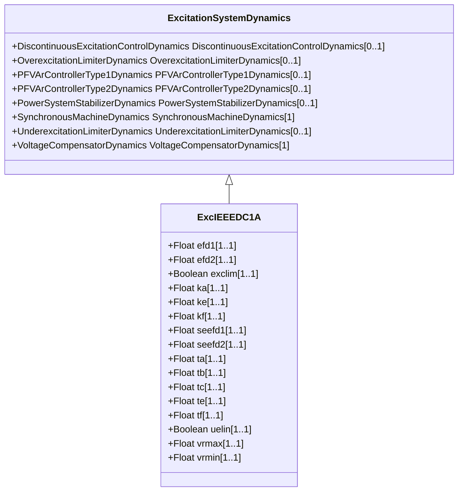

# ExcIEEEDC1A

IEEE 421.5-2005 type DC1A model. This model represents field-controlled DC commutator exciters with continuously acting voltage regulators (especially the direct-acting rheostatic, rotating amplifier, and magnetic amplifier types). Because this model has been widely implemented by the industry, it is sometimes used to represent other types of systems when detailed data for them are not available or when a simplified model is required. Reference: IEEE 421.5-2005, 5.1.

## Inheritance

<button class="mermaid-enlarge-button">Enlarge Diagram</button>

## Attributes

| Label | Type | Multiplicity | Comment |
|-------|------|--------------|---------|
| efd1 | Float | 1..1 | Exciter voltage at which exciter saturation is defined (EFD1) (> 0). Typical value = 3,1. |
| efd2 | Float | 1..1 | Exciter voltage at which exciter saturation is defined (EFD2) (> 0). Typical value = 2,3. |
| exclim | Boolean | 1..1 | (exclim). IEEE standard is ambiguous about lower limit on exciter output. true = a lower limit of zero is applied to integrator output false = a lower limit of zero is not applied to integrator output. Typical value = true. |
| ka | Float | 1..1 | Voltage regulator gain (KA) (> 0). Typical value = 46. |
| ke | Float | 1..1 | Exciter constant related to self-excited field (KE). Typical value = 0. |
| kf | Float | 1..1 | Excitation control system stabilizer gain (KF) (>= 0). Typical value = 0.1. |
| seefd1 | Float | 1..1 | Exciter saturation function value at the corresponding exciter voltage, EFD1 (SE[EFD1]) (>= 0). Typical value = 0.33. |
| seefd2 | Float | 1..1 | Exciter saturation function value at the corresponding exciter voltage, EFD2 (SE[EFD2]) (>= 0). Typical value = 0,1. |
| ta | Float | 1..1 | Voltage regulator time constant (TA) (> 0). Typical value = 0,06. |
| tb | Float | 1..1 | Voltage regulator time constant (TB) (>= 0). Typical value = 0. |
| tc | Float | 1..1 | Voltage regulator time constant (TC) (>= 0). Typical value = 0. |
| te | Float | 1..1 | Exciter time constant, integration rate associated with exciter control (TE) (> 0). Typical value = 0,46. |
| tf | Float | 1..1 | Excitation control system stabilizer time constant (TF) (> 0). Typical value = 1. |
| uelin | Boolean | 1..1 | UEL input (uelin). true = input is connected to the HV gate false = input connects to the error signal. Typical value = true. |
| vrmax | Float | 1..1 | Maximum voltage regulator output (VRMAX) (> ExcIEEEDC1A.vrmin). Typical value = 1. |
| vrmin | Float | 1..1 | Minimum voltage regulator output (VRMIN) (< 0 and < ExcIEEEDC1A.vrmax). Typical value = -0,9. |

