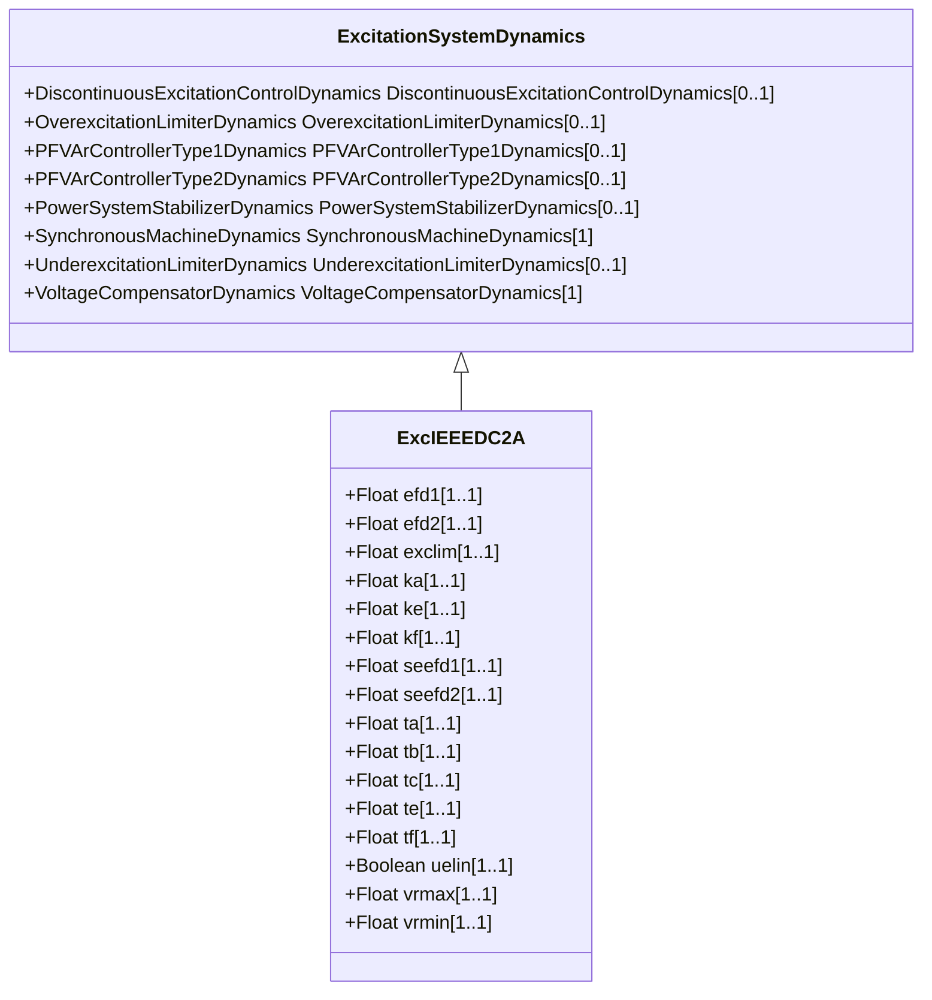

# ExcIEEEDC2A

IEEE 421.5-2005 type DC2A model. This model represents field-controlled DC commutator exciters with continuously acting voltage regulators having supplies obtained from the generator or auxiliary bus. It differs from the type DC1A model only in the voltage regulator output limits, which are now proportional to terminal voltage VT. It is representative of solid-state replacements for various forms of older mechanical and rotating amplifier regulating equipment connected to DC commutator exciters. Reference: IEEE 421.5-2005, 5.2.

## Inheritance

<button class="mermaid-enlarge-button">Enlarge Diagram</button>

## Attributes

| Label | Type | Multiplicity | Comment |
|-------|------|--------------|---------|
| efd1 | Float | 1..1 | Exciter voltage at which exciter saturation is defined (EFD1) (> 0). Typical value = 3,05. |
| efd2 | Float | 1..1 | Exciter voltage at which exciter saturation is defined (EFD2) (> 0). Typical value = 2,29. |
| exclim | Float | 1..1 | (exclim). IEEE standard is ambiguous about lower limit on exciter output. Typical value = - 999 which means that there is no limit applied. |
| ka | Float | 1..1 | Voltage regulator gain (KA) (> 0). Typical value = 300. |
| ke | Float | 1..1 | Exciter constant related to self-excited field (KE). Typical value = 1. |
| kf | Float | 1..1 | Excitation control system stabilizer gain (KF) (>= 0). Typical value = 0,1. |
| seefd1 | Float | 1..1 | Exciter saturation function value at the corresponding exciter voltage, EFD1 (SE[EFD1]) (>= 0). Typical value = 0,279. |
| seefd2 | Float | 1..1 | Exciter saturation function value at the corresponding exciter voltage, EFD2 (SE[EFD2]) (>= 0). Typical value = 0,117. |
| ta | Float | 1..1 | Voltage regulator time constant (TA) (> 0). Typical value = 0,01. |
| tb | Float | 1..1 | Voltage regulator time constant (TB) (>= 0). Typical value = 0. |
| tc | Float | 1..1 | Voltage regulator time constant (TC) (>= 0). Typical value = 0. |
| te | Float | 1..1 | Exciter time constant, integration rate associated with exciter control (TE) (> 0). Typical value = 1,33. |
| tf | Float | 1..1 | Excitation control system stabilizer time constant (TF) (> 0). Typical value = 0,675. |
| uelin | Boolean | 1..1 | UEL input (uelin). true = input is connected to the HV gate false = input connects to the error signal. Typical value = true. |
| vrmax | Float | 1..1 | Maximum voltage regulator output (VRMAX)(> ExcIEEEDC2A.vrmin). Typical value = 4,95. |
| vrmin | Float | 1..1 | Minimum voltage regulator output (VRMIN) (< 0 and < ExcIEEEDC2A.vrmax). Typical value = -4,9. |

