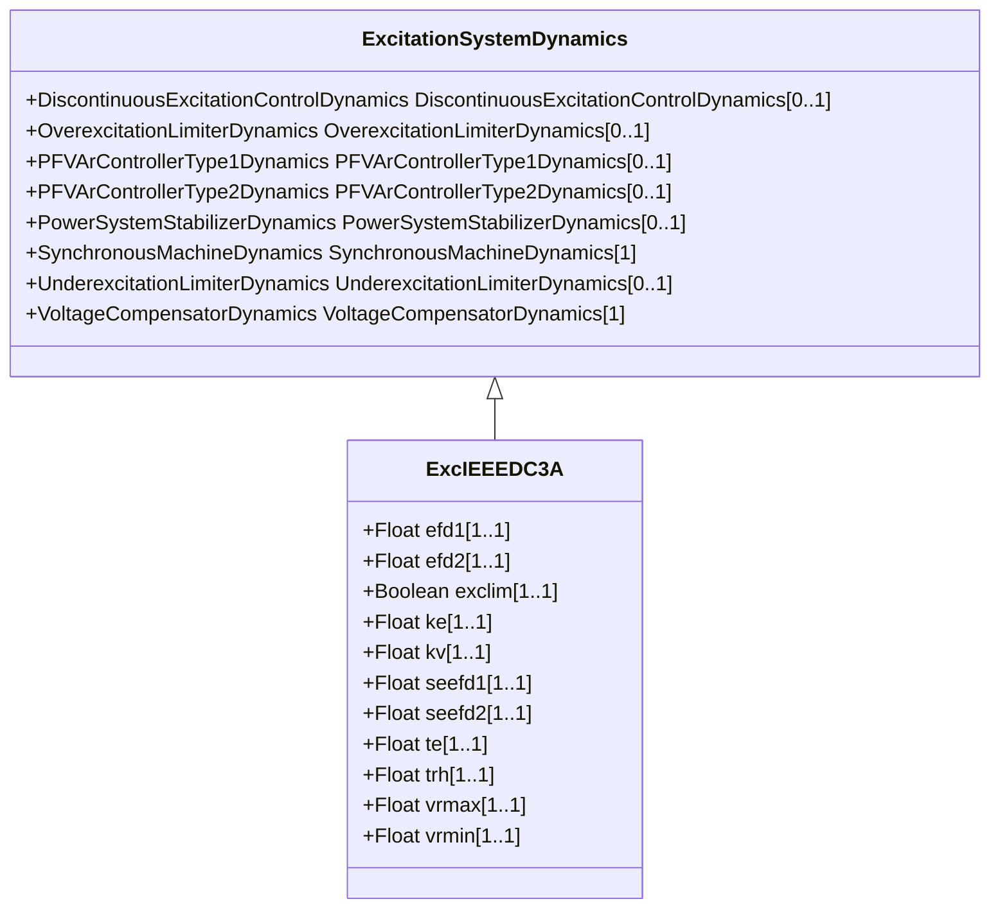

# ExcIEEEDC3A

IEEE 421.5-2005 type DC3A model. This model represents older systems, in particular those DC commutator exciters with non-continuously acting regulators that were commonly used before the development of the continuously acting varieties. These systems respond at basically two different rates, depending upon the magnitude of voltage error. For small errors, adjustment is made periodically with a signal to a motor-operated rheostat. Larger errors cause resistors to be quickly shorted or inserted and a strong forcing signal applied to the exciter. Continuous motion of the motor-operated rheostat occurs for these larger error signals, even though it is bypassed by contactor action. Reference: IEEE 421.5-2005, 5.3.

## Inheritance

<button class="mermaid-enlarge-button">Enlarge Diagram</button>

## Attributes

| Label | Type | Multiplicity | Comment |
|-------|------|--------------|---------|
| efd1 | Float | 1..1 | Exciter voltage at which exciter saturation is defined (EFD1) (> 0). Typical value = 3,375. |
| efd2 | Float | 1..1 | Exciter voltage at which exciter saturation is defined (EFD2) (> 0). Typical value = 3,15. |
| exclim | Boolean | 1..1 | (exclim). IEEE standard is ambiguous about lower limit on exciter output. true = a lower limit of zero is applied to integrator output false = a lower limit of zero is not applied to integrator output. Typical value = true. |
| ke | Float | 1..1 | Exciter constant related to self-excited field (KE). Typical value = 0,05. |
| kv | Float | 1..1 | Fast raise/lower contact setting (KV) (> 0). Typical value = 0,05. |
| seefd1 | Float | 1..1 | Exciter saturation function value at the corresponding exciter voltage, EFD1 (SE[EFD1]) (>= 0). Typical value = 0,267. |
| seefd2 | Float | 1..1 | Exciter saturation function value at the corresponding exciter voltage, EFD2 (SE[EFD2]) (>= 0). Typical value = 0,068. |
| te | Float | 1..1 | Exciter time constant, integration rate associated with exciter control (TE) (> 0). Typical value = 0,5. |
| trh | Float | 1..1 | Rheostat travel time (TRH) (> 0). Typical value = 20. |
| vrmax | Float | 1..1 | Maximum voltage regulator output (VRMAX) (> 0). Typical value = 1. |
| vrmin | Float | 1..1 | Minimum voltage regulator output (VRMIN) (<= 0). Typical value = 0. |

