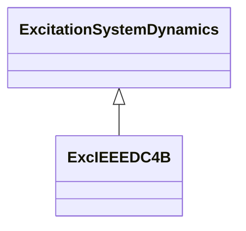

# ExcIEEEDC4B

IEEE 421.5-2005 type DC4B model. These excitation systems utilize a field-controlled DC commutator exciter with a continuously acting voltage regulator having supplies obtained from the generator or auxiliary bus. Reference: IEEE 421.5-2005, 5.4.

## Inheritance

<button class="mermaid-enlarge-button">Enlarge Diagram</button>

## Attributes

| Label | Type | Multiplicity | Comment |
|-------|------|--------------|---------|
| efd1 | Float | 1..1 | Exciter voltage at which exciter saturation is defined (EFD1) (> 0). Typical value = 1,75. |
| efd2 | Float | 1..1 | Exciter voltage at which exciter saturation is defined (EFD2) (> 0). Typical value = 2,33. |
| ka | Float | 1..1 | Voltage regulator gain (KA) (> 0). Typical value = 1. |
| kd | Float | 1..1 | Regulator derivative gain (KD) (>= 0). Typical value = 20. |
| ke | Float | 1..1 | Exciter constant related to self-excited field (KE). Typical value = 1. |
| kf | Float | 1..1 | Excitation control system stabilizer gain (KF) (>= 0). Typical value = 0. |
| ki | Float | 1..1 | Regulator integral gain (KI) (>= 0). Typical value = 20. |
| kp | Float | 1..1 | Regulator proportional gain (KP) (>= 0). Typical value = 20. |
| oelin | Boolean | 1..1 | OEL input (OELin). true = LV gate false = subtract from error signal. Typical value = true. |
| seefd1 | Float | 1..1 | Exciter saturation function value at the corresponding exciter voltage, EFD1 (SE[EFD1]) (>= 0). Typical value = 0,08. |
| seefd2 | Float | 1..1 | Exciter saturation function value at the corresponding exciter voltage, EFD2 (SE[EFD2]) (>= 0). Typical value = 0,27. |
| ta | Float | 1..1 | Voltage regulator time constant (TA) (> 0). Typical value = 0,2. |
| td | Float | 1..1 | Regulator derivative filter time constant (TD) (> 0 if ExcIEEEDC4B.kd > 0). Typical value = 0,01. |
| te | Float | 1..1 | Exciter time constant, integration rate associated with exciter control (TE) (> 0). Typical value = 0,8. |
| tf | Float | 1..1 | Excitation control system stabilizer time constant (TF) (>= 0). Typical value = 1. |
| uelin | Boolean | 1..1 | UEL input (UELin). true = HV gate false = add to error signal. Typical value = true. |
| vemin | Float | 1..1 | Minimum exciter voltage output (VEMIN) (<= 0). Typical value = 0. |
| vrmax | Float | 1..1 | Maximum voltage regulator output (VRMAX) (> ExcIEEEDC4B.vrmin). Typical value = 2,7. |
| vrmin | Float | 1..1 | Minimum voltage regulator output (VRMIN) (<= 0 and < ExcIEEEDC4B.vrmax). Typical value = -0,9. |

