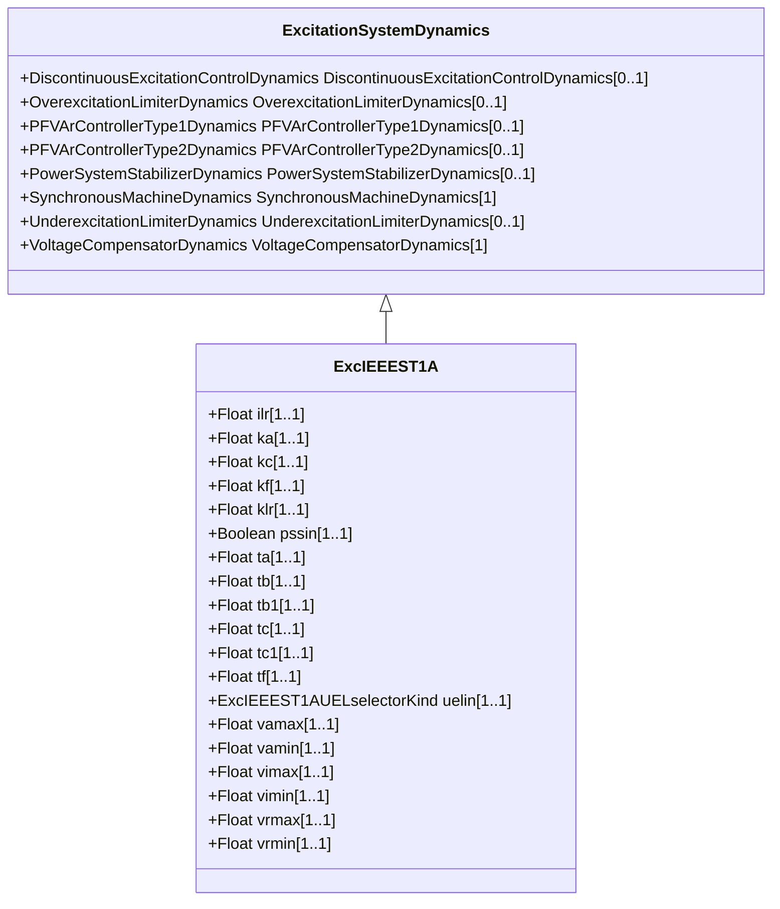

# ExcIEEEST1A

IEEE 421.5-2005 type ST1A model. This model represents systems in which excitation power is supplied through a transformer from the generator terminals (or the unit’s auxiliary bus) and is regulated by a controlled rectifier. The maximum exciter voltage available from such systems is directly related to the generator terminal voltage. Reference: IEEE 421.5-2005, 7.1.

## Inheritance

<button class="mermaid-enlarge-button">Enlarge Diagram</button>

## Attributes

| Label | Type | Multiplicity | Comment |
|-------|------|--------------|---------|
| ilr | Float | 1..1 | Exciter output current limit reference (ILR). Typical value = 0. |
| ka | Float | 1..1 | Voltage regulator gain (KA) (> 0). Typical value = 190. |
| kc | Float | 1..1 | Rectifier loading factor proportional to commutating reactance (KC) (>= 0). Typical value = 0,08. |
| kf | Float | 1..1 | Excitation control system stabilizer gains (KF) (>= 0). Typical value = 0. |
| klr | Float | 1..1 | Exciter output current limiter gain (KLR). Typical value = 0. |
| pssin | Boolean | 1..1 | Selector of the Power System Stabilizer (PSS) input (PSSin). true = PSS input (Vs) added to error signal false = PSS input (Vs) added to voltage regulator output. Typical value = true. |
| ta | Float | 1..1 | Voltage regulator time constant (TA) (>= 0). Typical value = 0. |
| tb | Float | 1..1 | Voltage regulator time constant (TB) (>= 0). Typical value = 10. |
| tb1 | Float | 1..1 | Voltage regulator time constant (TB1) (>= 0). Typical value = 0. |
| tc | Float | 1..1 | Voltage regulator time constant (TC) (>= 0). Typical value = 1. |
| tc1 | Float | 1..1 | Voltage regulator time constant (TC1) (>= 0). Typical value = 0. |
| tf | Float | 1..1 | Excitation control system stabilizer time constant (TF) (>= 0). Typical value = 1. |
| uelin | [ExcIEEEST1AUELselectorKind](ExcIEEEST1AUELselectorKind.md) | 1..1 | Selector of the connection of the UEL input (UELin). Typical value = ignoreUELsignal. |
| vamax | Float | 1..1 | Maximum voltage regulator output (VAMAX) (> 0). Typical value = 14,5. |
| vamin | Float | 1..1 | Minimum voltage regulator output (VAMIN) (< 0). Typical value = -14,5. |
| vimax | Float | 1..1 | Maximum voltage regulator input limit (VIMAX) (> 0). Typical value = 999. |
| vimin | Float | 1..1 | Minimum voltage regulator input limit (VIMIN) (< 0). Typical value = -999. |
| vrmax | Float | 1..1 | Maximum voltage regulator outputs (VRMAX) (> 0). Typical value = 7,8. |
| vrmin | Float | 1..1 | Minimum voltage regulator outputs (VRMIN) (< 0). Typical value = -6,7. |

