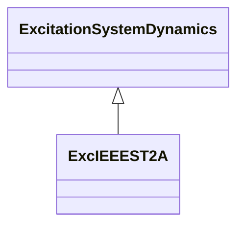

# ExcIEEEST2A

IEEE 421.5-2005 type ST2A model. Some static systems use both current and voltage sources (generator terminal quantities) to comprise the power source. The regulator controls the exciter output through controlled saturation of the power transformer components. These compound-source rectifier excitation systems are designated type ST2A and are represented by ExcIEEEST2A. Reference: IEEE 421.5-2005, 7.2.

## Inheritance

<button class="mermaid-enlarge-button">Enlarge Diagram</button>

## Attributes

| Label | Type | Multiplicity | Comment |
|-------|------|--------------|---------|
| efdmax | Float | 1..1 | Maximum field voltage (EFDMax) (>= 0). Typical value = 99. |
| ka | Float | 1..1 | Voltage regulator gain (KA) (> 0). Typical value = 120. |
| kc | Float | 1..1 | Rectifier loading factor proportional to commutating reactance (KC) (>= 0). Typical value = 1,82. |
| ke | Float | 1..1 | Exciter constant related to self-excited field (KE). Typical value = 1. |
| kf | Float | 1..1 | Excitation control system stabilizer gains (KF) (>= 0). Typical value = 0,05. |
| ki | Float | 1..1 | Potential circuit gain coefficient (KI) (>= 0). Typical value = 8. |
| kp | Float | 1..1 | Potential circuit gain coefficient (KP) (>= 0). Typical value = 4,88. |
| ta | Float | 1..1 | Voltage regulator time constant (TA) (> 0). Typical value = 0,15. |
| te | Float | 1..1 | Exciter time constant, integration rate associated with exciter control (TE) (> 0). Typical value = 0,5. |
| tf | Float | 1..1 | Excitation control system stabilizer time constant (TF) (>= 0). Typical value = 1. |
| uelin | Boolean | 1..1 | UEL input (UELin). true = HV gate false = add to error signal. Typical value = true. |
| vrmax | Float | 1..1 | Maximum voltage regulator outputs (VRMAX) (> 0). Typical value = 1. |
| vrmin | Float | 1..1 | Minimum voltage regulator outputs (VRMIN) (<= 0). Typical value = 0. |

