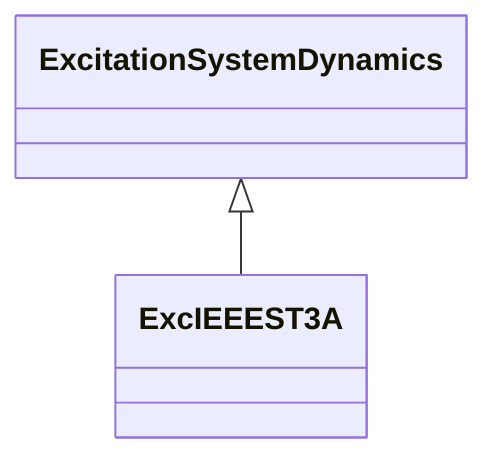

# ExcIEEEST3A

IEEE 421.5-2005 type ST3A model. Some static systems utilize a field voltage control loop to linearize the exciter control characteristic. This also makes the output independent of supply source variations until supply limitations are reached. These systems utilize a variety of controlled-rectifier designs: full thyristor complements or hybrid bridges in either series or shunt configurations. The power source can consist of only a potential source, either fed from the machine terminals or from internal windings. Some designs can have compound power sources utilizing both machine potential and current. These power sources are represented as phasor combinations of machine terminal current and voltage and are accommodated by suitable parameters in model type ST3A which is represented by ExcIEEEST3A. Reference: IEEE 421.5-2005, 7.3.

## Inheritance

<button class="mermaid-enlarge-button">Enlarge Diagram</button>

## Attributes

| Label | Type | Multiplicity | Comment |
|-------|------|--------------|---------|
| ka | Float | 1..1 | Voltage regulator gain (KA) (> 0). This is parameter K in the IEEE standard. Typical value = 200. |
| kc | Float | 1..1 | Rectifier loading factor proportional to commutating reactance (KC) (>= 0). Typical value = 0,2. |
| kg | Float | 1..1 | Feedback gain constant of the inner loop field regulator (KG) (>= 0). Typical value = 1. |
| ki | Float | 1..1 | Potential circuit gain coefficient (KI) (>= 0). Typical value = 0. |
| km | Float | 1..1 | Forward gain constant of the inner loop field regulator (KM) (> 0). Typical value = 7,93. |
| kp | Float | 1..1 | Potential circuit gain coefficient (KP) (> 0). Typical value = 6,15. |
| ta | Float | 1..1 | Voltage regulator time constant (TA) (>= 0). Typical value = 0. |
| tb | Float | 1..1 | Voltage regulator time constant (TB) (>= 0). Typical value = 10. |
| tc | Float | 1..1 | Voltage regulator time constant (TC) (>= 0). Typical value = 1. |
| thetap | Float | 1..1 | Potential circuit phase angle (thetap). Typical value = 0. |
| tm | Float | 1..1 | Forward time constant of inner loop field regulator (TM) (> 0). Typical value = 0,4. |
| vbmax | Float | 1..1 | Maximum excitation voltage (VBMax) (> 0). Typical value = 6,9. |
| vgmax | Float | 1..1 | Maximum inner loop feedback voltage (VGMax) (>= 0). Typical value = 5,8. |
| vimax | Float | 1..1 | Maximum voltage regulator input limit (VIMAX) (> 0). Typical value = 0,2. |
| vimin | Float | 1..1 | Minimum voltage regulator input limit (VIMIN) (< 0). Typical value = -0,2. |
| vmmax | Float | 1..1 | Maximum inner loop output (VMMax) (> 0). Typical value = 1. |
| vmmin | Float | 1..1 | Minimum inner loop output (VMMin) (<= 0). Typical value = 0. |
| vrmax | Float | 1..1 | Maximum voltage regulator output (VRMAX) (> 0). Typical value = 10. |
| vrmin | Float | 1..1 | Minimum voltage regulator output (VRMIN) (< 0). Typical value = -10. |
| xl | Float | 1..1 | Reactance associated with potential source (XL) (>= 0). Typical value = 0,081. |

