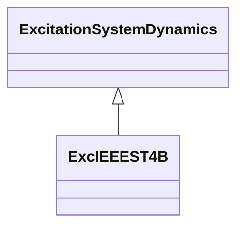

# ExcIEEEST4B

IEEE 421.5-2005 type ST4B model. This model is a variation of the type ST3A model, with a proportional plus integral (PI) regulator block replacing the lag-lead regulator characteristic that is in the ST3A model. Both potential and compound source rectifier excitation systems are modelled. The PI regulator blocks have non-windup limits that are represented. The voltage regulator of this model is typically implemented digitally. Reference: IEEE 421.5-2005, 7.4.

## Inheritance

<button class="mermaid-enlarge-button">Enlarge Diagram</button>

## Attributes

| Label | Type | Multiplicity | Comment |
|-------|------|--------------|---------|
| kc | Float | 1..1 | Rectifier loading factor proportional to commutating reactance (KC) (>= 0). Typical value = 0,113. |
| kg | Float | 1..1 | Feedback gain constant of the inner loop field regulator (KG) (>= 0). Typical value = 0. |
| ki | Float | 1..1 | Potential circuit gain coefficient (KI) (>= 0). Typical value = 0. |
| kim | Float | 1..1 | Voltage regulator integral gain output (KIM). Typical value = 0. |
| kir | Float | 1..1 | Voltage regulator integral gain (KIR). Typical value = 10,75. |
| kp | Float | 1..1 | Potential circuit gain coefficient (KP) (> 0). Typical value = 9,3. |
| kpm | Float | 1..1 | Voltage regulator proportional gain output (KPM). Typical value = 1. |
| kpr | Float | 1..1 | Voltage regulator proportional gain (KPR). Typical value = 10,75. |
| ta | Float | 1..1 | Voltage regulator time constant (TA) (>= 0). Typical value = 0,02. |
| thetap | Float | 1..1 | Potential circuit phase angle (thetap). Typical value = 0. |
| vbmax | Float | 1..1 | Maximum excitation voltage (VBMax) (> 0). Typical value = 11,63. |
| vmmax | Float | 1..1 | Maximum inner loop output (VMMax) (> ExcIEEEST4B.vmmin). Typical value = 99. |
| vmmin | Float | 1..1 | Minimum inner loop output (VMMin) (< ExcIEEEST4B.vmmax). Typical value = -99. |
| vrmax | Float | 1..1 | Maximum voltage regulator output (VRMAX) (> 0). Typical value = 1. |
| vrmin | Float | 1..1 | Minimum voltage regulator output (VRMIN) (< 0). Typical value = -0,87. |
| xl | Float | 1..1 | Reactance associated with potential source (XL) (>= 0). Typical value = 0,124. |

