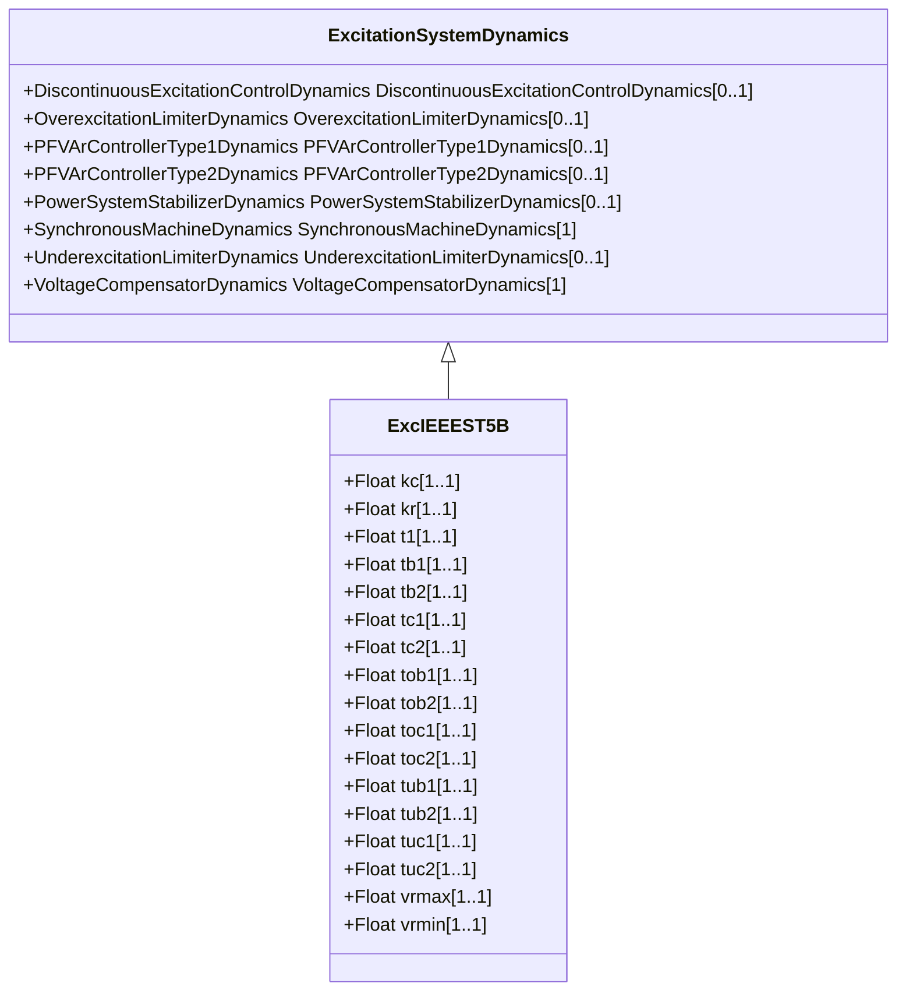

# ExcIEEEST5B

IEEE 421.5-2005 type ST5B model. The type ST5B excitation system is a variation of the type ST1A model, with alternative overexcitation and underexcitation inputs and additional limits. The block diagram in the IEEE 421.5 standard has input signal Vc and does not indicate the summation point with Vref. The implementation of the ExcIEEEST5B shall consider summation point with Vref. Reference: IEEE 421.5-2005, 7.5.

## Inheritance

<button class="mermaid-enlarge-button">Enlarge Diagram</button>

## Attributes

| Label | Type | Multiplicity | Comment |
|-------|------|--------------|---------|
| kc | Float | 1..1 | Rectifier regulation factor (KC) (>= 0). Typical value = 0,004. |
| kr | Float | 1..1 | Regulator gain (KR) (> 0). Typical value = 200. |
| t1 | Float | 1..1 | Firing circuit time constant (T1) (>= 0). Typical value = 0,004. |
| tb1 | Float | 1..1 | Regulator lag time constant (TB1) (>= 0). Typical value = 6. |
| tb2 | Float | 1..1 | Regulator lag time constant (TB2) (>= 0). Typical value = 0,01. |
| tc1 | Float | 1..1 | Regulator lead time constant (TC1) (>= 0). Typical value = 0,8. |
| tc2 | Float | 1..1 | Regulator lead time constant (TC2) (>= 0). Typical value = 0,08. |
| tob1 | Float | 1..1 | OEL lag time constant (TOB1) (>= 0). Typical value = 2. |
| tob2 | Float | 1..1 | OEL lag time constant (TOB2) (>= 0). Typical value = 0,08. |
| toc1 | Float | 1..1 | OEL lead time constant (TOC1) (>= 0). Typical value = 0,1. |
| toc2 | Float | 1..1 | OEL lead time constant (TOC2) (>= 0). Typical value = 0,08. |
| tub1 | Float | 1..1 | UEL lag time constant (TUB1) (>= 0). Typical value = 10. |
| tub2 | Float | 1..1 | UEL lag time constant (TUB2) (>= 0). Typical value = 0,05. |
| tuc1 | Float | 1..1 | UEL lead time constant (TUC1) (>= 0). Typical value = 2. |
| tuc2 | Float | 1..1 | UEL lead time constant (TUC2) (>= 0). Typical value = 0,1. |
| vrmax | Float | 1..1 | Maximum voltage regulator output (VRMAX) (> 0). Typical value = 5. |
| vrmin | Float | 1..1 | Minimum voltage regulator output (VRMIN) (< 0). Typical value = -4. |

