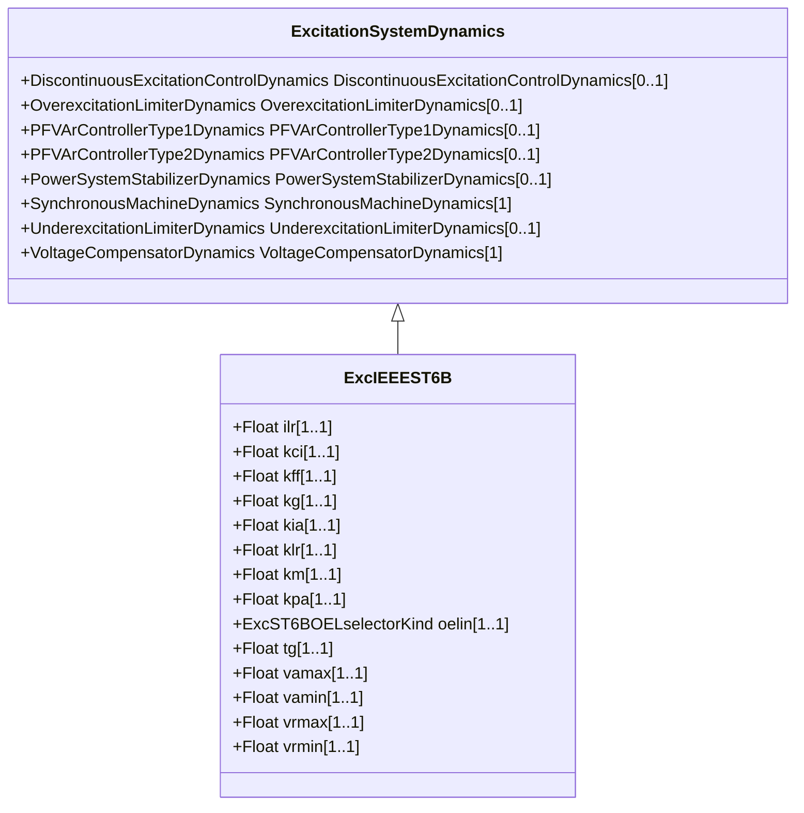

# ExcIEEEST6B

IEEE 421.5-2005 type ST6B model. This model consists of a PI voltage regulator with an inner loop field voltage regulator and pre-control. The field voltage regulator implements a proportional control. The pre-control and the delay in the feedback circuit increase the dynamic response. Reference: IEEE 421.5-2005, 7.6.

## Inheritance

<button class="mermaid-enlarge-button">Enlarge Diagram</button>

## Attributes

| Label | Type | Multiplicity | Comment |
|-------|------|--------------|---------|
| ilr | Float | 1..1 | Exciter output current limit reference (ILR) (> 0). Typical value = 4,164. |
| kci | Float | 1..1 | Exciter output current limit adjustment (KCI) (> 0). Typical value = 1,0577. |
| kff | Float | 1..1 | Pre-control gain constant of the inner loop field regulator (KFF). Typical value = 1. |
| kg | Float | 1..1 | Feedback gain constant of the inner loop field regulator (KG) (>= 0). Typical value = 1. |
| kia | Float | 1..1 | Voltage regulator integral gain (KIA) (> 0). Typical value = 45,094. |
| klr | Float | 1..1 | Exciter output current limiter gain (KLR) (> 0). Typical value = 17,33. |
| km | Float | 1..1 | Forward gain constant of the inner loop field regulator (KM). Typical value = 1. |
| kpa | Float | 1..1 | Voltage regulator proportional gain (KPA) (> 0). Typical value = 18,038. |
| oelin | [ExcST6BOELselectorKind](ExcST6BOELselectorKind.md) | 1..1 | OEL input selector (OELin). Typical value = noOELinput. |
| tg | Float | 1..1 | Feedback time constant of inner loop field voltage regulator (TG) (>= 0). Typical value = 0,02. |
| vamax | Float | 1..1 | Maximum voltage regulator output (VAMAX) (> 0). Typical value = 4,81. |
| vamin | Float | 1..1 | Minimum voltage regulator output (VAMIN) (< 0). Typical value = -3,85. |
| vrmax | Float | 1..1 | Maximum voltage regulator output (VRMAX) (> 0). Typical value = 4,81. |
| vrmin | Float | 1..1 | Minimum voltage regulator output (VRMIN) (< 0). Typical value = -3,85. |

