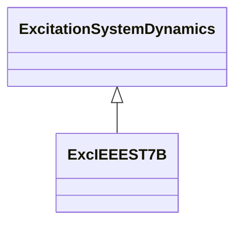

# ExcIEEEST7B

IEEE 421.5-2005 type ST7B model. This model is representative of static potential-source excitation systems. In this system, the AVR consists of a PI voltage regulator. A phase lead-lag filter in series allows the introduction of a derivative function, typically used with brushless excitation systems. In that case, the regulator is of the PID type. In addition, the terminal voltage channel includes a phase lead-lag filter. The AVR includes the appropriate inputs on its reference for overexcitation limiter (OEL1), underexcitation limiter (UEL), stator current limiter (SCL), and current compensator (DROOP). All these limitations, when they work at voltage reference level, keep the PSS (VS signal from PSS) in operation. However, the UEL limitation can also be transferred to the high value (HV) gate acting on the output signal. In addition, the output signal passes through a low value (LV) gate for a ceiling overexcitation limiter (OEL2). Reference: IEEE 421.5-2005, 7.7.

## Inheritance

<button class="mermaid-enlarge-button">Enlarge Diagram</button>

## Attributes

| Label | Type | Multiplicity | Comment |
|-------|------|--------------|---------|
| kh | Float | 1..1 | High-value gate feedback gain (KH) (>= 0). Typical value = 1. |
| kia | Float | 1..1 | Voltage regulator integral gain (KIA) (>= 0). Typical value = 1. |
| kl | Float | 1..1 | Low-value gate feedback gain (KL) (>= 0). Typical value = 1. |
| kpa | Float | 1..1 | Voltage regulator proportional gain (KPA) (> 0). Typical value = 40. |
| oelin | [ExcST7BOELselectorKind](ExcST7BOELselectorKind.md) | 1..1 | OEL input selector (OELin). Typical value = noOELinput. |
| tb | Float | 1..1 | Regulator lag time constant (TB) (>= 0). Typical value = 1. |
| tc | Float | 1..1 | Regulator lead time constant (TC) (>= 0). Typical value = 1. |
| tf | Float | 1..1 | Excitation control system stabilizer time constant (TF) (>= 0). Typical value = 1. |
| tg | Float | 1..1 | Feedback time constant of inner loop field voltage regulator (TG) (>= 0). Typical value = 1. |
| tia | Float | 1..1 | Feedback time constant (TIA) (>= 0). Typical value = 3. |
| uelin | [ExcST7BUELselectorKind](ExcST7BUELselectorKind.md) | 1..1 | UEL input selector (UELin). Typical value = noUELinput. |
| vmax | Float | 1..1 | Maximum voltage reference signal (VMAX) (> 0 and > ExcIEEEST7B.vmin). Typical value = 1,1. |
| vmin | Float | 1..1 | Minimum voltage reference signal (VMIN) (> 0 and < ExcIEEEST7B.vmax). Typical value = 0,9. |
| vrmax | Float | 1..1 | Maximum voltage regulator output (VRMAX) (> 0). Typical value = 5. |
| vrmin | Float | 1..1 | Minimum voltage regulator output (VRMIN) (< 0). Typical value = -4,5. |

