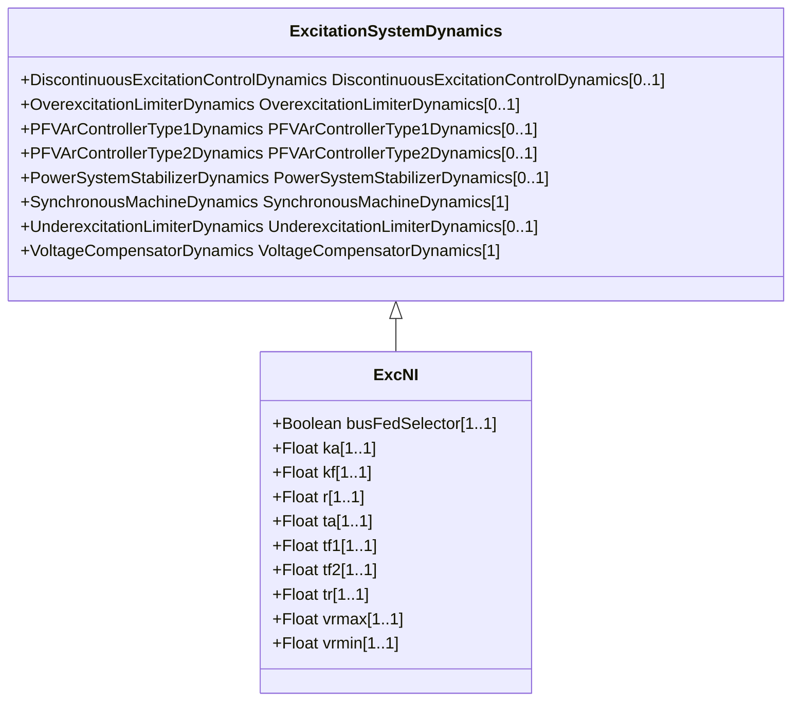

# ExcNI

Bus or solid fed SCR (silicon-controlled rectifier) bridge excitation system model type NI (NVE).

## Inheritance

<button class="mermaid-enlarge-button">Enlarge Diagram</button>

## Attributes

| Label | Type | Multiplicity | Comment |
|-------|------|--------------|---------|
| busFedSelector | Boolean | 1..1 | Fed by selector (BusFedSelector). true = bus fed (switch is closed) false = solid fed (switch is open). Typical value = true. |
| ka | Float | 1..1 | Voltage regulator gain (Ka) (> 0). Typical value = 210. |
| kf | Float | 1..1 | Excitation control system stabilizer gain (Kf) (> 0). Typical value 0,01. |
| r | Float | 1..1 | rc / rfd (R) (>= 0). 0 means exciter has negative current capability > 0 means exciter does not have negative current capability. Typical value = 5. |
| ta | Float | 1..1 | Voltage regulator time constant (Ta) (> 0). Typical value = 0,02. |
| tf1 | Float | 1..1 | Excitation control system stabilizer time constant (Tf1) (> 0). Typical value = 1,0. |
| tf2 | Float | 1..1 | Excitation control system stabilizer time constant (Tf2) (> 0). Typical value = 0,1. |
| tr | Float | 1..1 | Time constant (Tr) (>= 0). Typical value = 0,02. |
| vrmax | Float | 1..1 | Maximum voltage regulator ouput (Vrmax) (> ExcNI.vrmin). Typical value = 5,0. |
| vrmin | Float | 1..1 | Minimum voltage regulator ouput (Vrmin) (< ExcNI.vrmax). Typical value = -2,0. |

