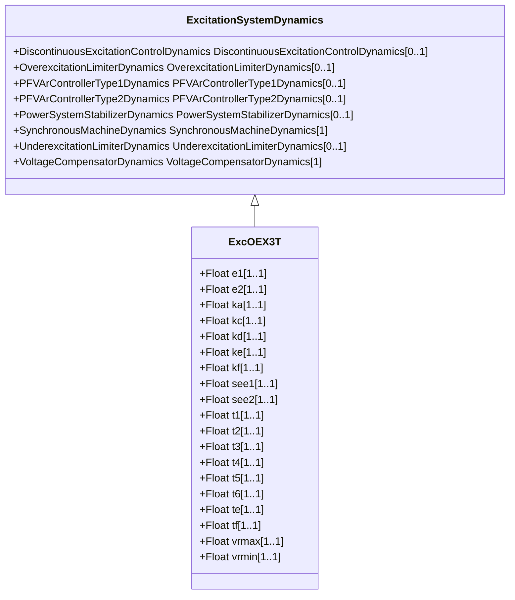

# ExcOEX3T

Modified IEEE type ST1 excitation system with semi-continuous and acting terminal voltage limiter.

## Inheritance

<button class="mermaid-enlarge-button">Enlarge Diagram</button>

## Attributes

| Label | Type | Multiplicity | Comment |
|-------|------|--------------|---------|
| e1 | Float | 1..1 | Saturation parameter (E1). |
| e2 | Float | 1..1 | Saturation parameter (E2). |
| ka | Float | 1..1 | Gain (KA). |
| kc | Float | 1..1 | Gain (KC). |
| kd | Float | 1..1 | Gain (KD). |
| ke | Float | 1..1 | Gain (KE). |
| kf | Float | 1..1 | Gain (KF). |
| see1 | Float | 1..1 | Saturation parameter (SE[E1]). |
| see2 | Float | 1..1 | Saturation parameter (SE[E2]). |
| t1 | Float | 1..1 | Time constant (T1) (>= 0). |
| t2 | Float | 1..1 | Time constant (T2) (>= 0). |
| t3 | Float | 1..1 | Time constant (T3) (>= 0). |
| t4 | Float | 1..1 | Time constant (T4) (>= 0). |
| t5 | Float | 1..1 | Time constant (T5) (>= 0). |
| t6 | Float | 1..1 | Time constant (T6) (>= 0). |
| te | Float | 1..1 | Time constant (TE) (>= 0). |
| tf | Float | 1..1 | Time constant (TF) (>= 0). |
| vrmax | Float | 1..1 | Limiter (VRMAX) (> ExcOEX3T.vrmin). |
| vrmin | Float | 1..1 | Limiter (VRMIN) (< ExcOEX3T.vrmax). |

