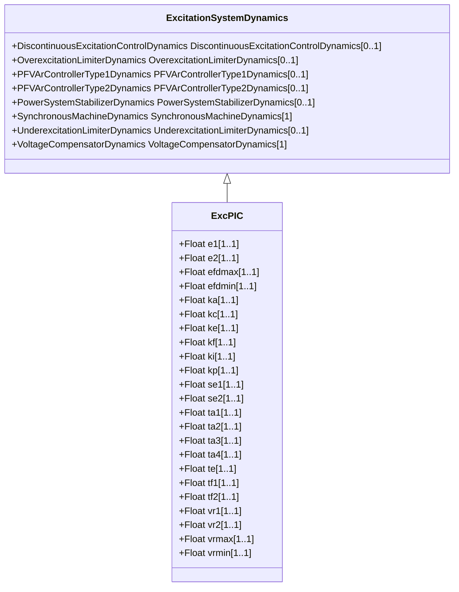

# ExcPIC

Proportional/integral regulator excitation system. This model can be used to represent excitation systems with a proportional-integral (PI) voltage regulator controller.

## Inheritance

<button class="mermaid-enlarge-button">Enlarge Diagram</button>

## Attributes

| Label | Type | Multiplicity | Comment |
|-------|------|--------------|---------|
| e1 | Float | 1..1 | Field voltage value 1 (E1). Typical value = 0. |
| e2 | Float | 1..1 | Field voltage value 2 (E2). Typical value = 0. |
| efdmax | Float | 1..1 | Exciter maximum limit (Efdmax) (> ExcPIC.efdmin). Typical value = 8. |
| efdmin | Float | 1..1 | Exciter minimum limit (Efdmin) (< ExcPIC.efdmax). Typical value = -0,87. |
| ka | Float | 1..1 | PI controller gain (Ka). Typical value = 3,15. |
| kc | Float | 1..1 | Exciter regulation factor (Kc). Typical value = 0,08. |
| ke | Float | 1..1 | Exciter constant (Ke). Typical value = 0. |
| kf | Float | 1..1 | Rate feedback gain (Kf). Typical value = 0. |
| ki | Float | 1..1 | Current source gain (Ki). Typical value = 0. |
| kp | Float | 1..1 | Potential source gain (Kp). Typical value = 6,5. |
| se1 | Float | 1..1 | Saturation factor at E1 (Se1). Typical value = 0. |
| se2 | Float | 1..1 | Saturation factor at E2 (Se2). Typical value = 0. |
| ta1 | Float | 1..1 | PI controller time constant (Ta1) (>= 0). Typical value = 1. |
| ta2 | Float | 1..1 | Voltage regulator time constant (Ta2) (>= 0). Typical value = 0,01. |
| ta3 | Float | 1..1 | Lead time constant (Ta3) (>= 0). Typical value = 0. |
| ta4 | Float | 1..1 | Lag time constant (Ta4) (>= 0). Typical value = 0. |
| te | Float | 1..1 | Exciter time constant (Te) (>= 0). Typical value = 0. |
| tf1 | Float | 1..1 | Rate feedback time constant (Tf1) (>= 0). Typical value = 0. |
| tf2 | Float | 1..1 | Rate feedback lag time constant (Tf2) (>= 0). Typical value = 0. |
| vr1 | Float | 1..1 | PI maximum limit (Vr1). Typical value = 1. |
| vr2 | Float | 1..1 | PI minimum limit (Vr2). Typical value = -0,87. |
| vrmax | Float | 1..1 | Voltage regulator maximum limit (Vrmax) (> ExcPIC.vrmin). Typical value = 1. |
| vrmin | Float | 1..1 | Voltage regulator minimum limit (Vrmin) (< ExcPIC.vrmax). Typical value = -0,87. |

