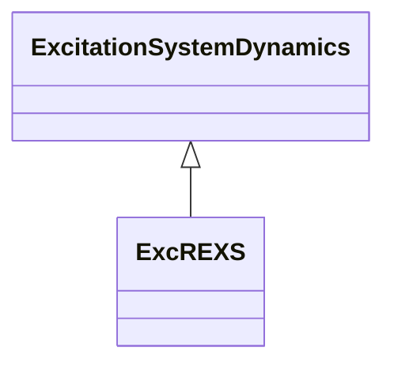

# ExcREXS

General purpose rotating excitation system. This model can be used to represent a wide range of excitation systems whose DC power source is an AC or DC generator. It encompasses IEEE type AC1, AC2, DC1, and DC2 excitation system models.

## Inheritance

<button class="mermaid-enlarge-button">Enlarge Diagram</button>

## Attributes

| Label | Type | Multiplicity | Comment |
|-------|------|--------------|---------|
| e1 | Float | 1..1 | Field voltage value 1 (E1). Typical value = 3. |
| e2 | Float | 1..1 | Field voltage value 2 (E2). Typical value = 4. |
| fbf | [ExcREXSFeedbackSignalKind](ExcREXSFeedbackSignalKind.md) | 1..1 | Rate feedback signal flag (fbf). Typical value = fieldCurrent. |
| flimf | Float | 1..1 | Limit type flag (Flimf). Typical value = 0. |
| kc | Float | 1..1 | Rectifier regulation factor (Kc). Typical value = 0,05. |
| kd | Float | 1..1 | Exciter regulation factor (Kd). Typical value = 2. |
| ke | Float | 1..1 | Exciter field proportional constant (Ke). Typical value = 1. |
| kefd | Float | 1..1 | Field voltage feedback gain (Kefd). Typical value = 0. |
| kf | Float | 1..1 | Rate feedback gain (Kf) (>= 0). Typical value = 0,05. |
| kh | Float | 1..1 | Field voltage controller feedback gain (Kh). Typical value = 0. |
| kii | Float | 1..1 | Field current regulator integral gain (Kii). Typical value = 0. |
| kip | Float | 1..1 | Field current regulator proportional gain (Kip). Typical value = 1. |
| ks | Float | 1..1 | Coefficient to allow different usage of the model-speed coefficient (Ks). Typical value = 0. |
| kvi | Float | 1..1 | Voltage regulator integral gain (Kvi). Typical value = 0. |
| kvp | Float | 1..1 | Voltage regulator proportional gain (Kvp). Typical value = 2800. |
| kvphz | Float | 1..1 | V/Hz limiter gain (Kvphz). Typical value = 0. |
| nvphz | Float | 1..1 | Pickup speed of V/Hz limiter (Nvphz). Typical value = 0. |
| se1 | Float | 1..1 | Saturation factor at E1 (Se1). Typical value = 0,0001. |
| se2 | Float | 1..1 | Saturation factor at E2 (Se2). Typical value = 0,001. |
| ta | Float | 1..1 | Voltage regulator time constant (Ta) (>= 0). If = 0, block is bypassed. Typical value = 0,01. |
| tb1 | Float | 1..1 | Lag time constant (Tb1) (>= 0). If = 0, block is bypassed. Typical value = 0. |
| tb2 | Float | 1..1 | Lag time constant (Tb2) (>= 0). If = 0, block is bypassed. Typical value = 0. |
| tc1 | Float | 1..1 | Lead time constant (Tc1) (>= 0). Typical value = 0. |
| tc2 | Float | 1..1 | Lead time constant (Tc2) (>= 0). Typical value = 0. |
| te | Float | 1..1 | Exciter field time constant (Te) (> 0). Typical value = 1,2. |
| tf | Float | 1..1 | Rate feedback time constant (Tf) (>= 0). If = 0, the feedback path is not used. Typical value = 1. |
| tf1 | Float | 1..1 | Feedback lead time constant (Tf1) (>= 0). Typical value = 0. |
| tf2 | Float | 1..1 | Feedback lag time constant (Tf2) (>= 0). If = 0, block is bypassed. Typical value = 0. |
| tp | Float | 1..1 | Field current bridge time constant (Tp) (>= 0). Typical value = 0. |
| vcmax | Float | 1..1 | Maximum compounding voltage (Vcmax). Typical value = 0. |
| vfmax | Float | 1..1 | Maximum exciter field current (Vfmax) (> ExcREXS.vfmin). Typical value = 47. |
| vfmin | Float | 1..1 | Minimum exciter field current (Vfmin) (< ExcREXS.vfmax). Typical value = -20. |
| vimax | Float | 1..1 | Voltage regulator input limit (Vimax). Typical value = 0,1. |
| vrmax | Float | 1..1 | Maximum controller output (Vrmax) (> ExcREXS.vrmin). Typical value = 47. |
| vrmin | Float | 1..1 | Minimum controller output (Vrmin) (< ExcREXS.vrmax). Typical value = -20. |
| xc | Float | 1..1 | Exciter compounding reactance (Xc). Typical value = 0. |

