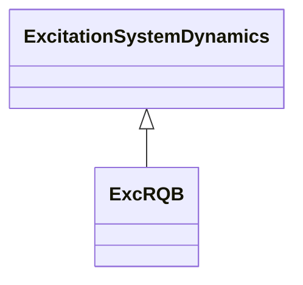

# ExcRQB

Excitation system type RQB (four-loop regulator, r?gulateur quatre boucles, developed in France) primarily used in nuclear or thermal generating units. This excitation system shall be always used together with power system stabilizer type PssRQB.

## Inheritance

<button class="mermaid-enlarge-button">Enlarge Diagram</button>

## Attributes

| Label | Type | Multiplicity | Comment |
|-------|------|--------------|---------|
| ki0 | Float | 1..1 | Voltage reference input gain (Ki0). Typical value = 12,7. |
| ki1 | Float | 1..1 | Voltage input gain (Ki1). Typical value = -16,8. |
| klir | Float | 1..1 | OEL input gain (KLIR). Typical value = 12,13. |
| klus | Float | 1..1 | Limiter gain (KLUS). Typical value = 50. |
| lsat | Float | 1..1 | Integrator limiter (LSAT). Typical value = 5,73. |
| lus | Float | 1..1 | Setpoint (LUS). Typical value = 0,12. |
| mesu | Float | 1..1 | Voltage input time constant (MESU) (>= 0). Typical value = 0,02. |
| t4m | Float | 1..1 | Input time constant (T4M) (>= 0). Typical value = 5. |
| tc | Float | 1..1 | Lead lag time constant (TC) (>= 0). Typical value = 0,02. |
| te | Float | 1..1 | Lead lag time constant (TE) (>= 0). Typical value = 0,22. |
| tf | Float | 1..1 | Exciter time constant (TF) (>= 0). Typical value = 0,01. |
| ucmax | Float | 1..1 | Maximum voltage reference limit (UCMAX) (> ExcRQB.ucmin). Typical value = 1,1. |
| ucmin | Float | 1..1 | Minimum voltage reference limit (UCMIN) (< ExcRQB.ucmax). Typical value = 0,9. |

