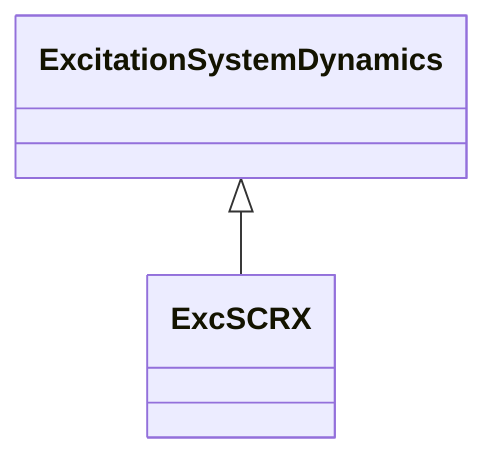

# ExcSCRX

Simple excitation system with generic characteristics typical of many excitation systems; intended for use where negative field current could be a problem.

## Inheritance

<button class="mermaid-enlarge-button">Enlarge Diagram</button>

## Attributes

| Label | Type | Multiplicity | Comment |
|-------|------|--------------|---------|
| cswitch | Boolean | 1..1 | Power source switch (Cswitch). true = fixed voltage of 1.0 PU false = generator terminal voltage. |
| emax | Float | 1..1 | Maximum field voltage output (Emax) (> ExcSCRX.emin). Typical value = 5. |
| emin | Float | 1..1 | Minimum field voltage output (Emin) (< ExcSCRX.emax). Typical value = 0. |
| k | Float | 1..1 | Gain (K) (> 0). Typical value = 200. |
| rcrfd | Float | 1..1 | Ratio of field discharge resistance to field winding resistance ([rc / rfd]). Typical value = 0. |
| tatb | Float | 1..1 | Gain reduction ratio of lag-lead element ([Ta / Tb]). The parameter Ta is not defined explicitly. Typical value = 0.1. |
| tb | Float | 1..1 | Denominator time constant of lag-lead block (Tb) (>= 0). Typical value = 10. |
| te | Float | 1..1 | Time constant of gain block (Te) (> 0). Typical value = 0,02. |

