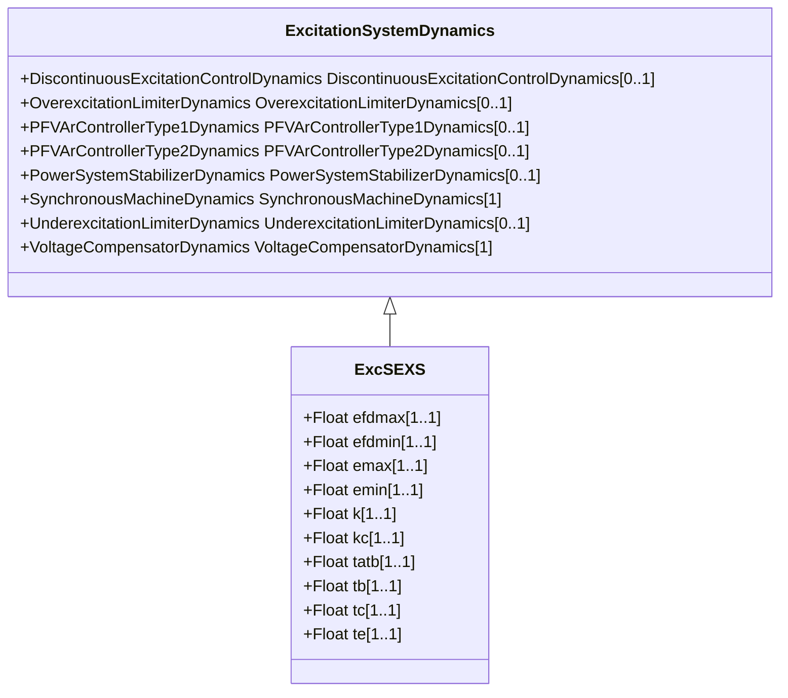

# ExcSEXS

Simplified excitation system.

## Inheritance

<button class="mermaid-enlarge-button">Enlarge Diagram</button>

## Attributes

| Label | Type | Multiplicity | Comment |
|-------|------|--------------|---------|
| efdmax | Float | 1..1 | Field voltage clipping maximum limit (Efdmax) (> ExcSEXS.efdmin). Typical value = 5. |
| efdmin | Float | 1..1 | Field voltage clipping minimum limit (Efdmin) (< ExcSEXS.efdmax). Typical value = -5. |
| emax | Float | 1..1 | Maximum field voltage output (Emax) (> ExcSEXS.emin). Typical value = 5. |
| emin | Float | 1..1 | Minimum field voltage output (Emin) (< ExcSEXS.emax). Typical value = -5. |
| k | Float | 1..1 | Gain (K) (> 0). Typical value = 100. |
| kc | Float | 1..1 | PI controller gain (Kc) (> 0 if ExcSEXS.tc > 0). Typical value = 0,08. |
| tatb | Float | 1..1 | Gain reduction ratio of lag-lead element ([Ta / Tb]). Typical value = 0,1. |
| tb | Float | 1..1 | Denominator time constant of lag-lead block (Tb) (>= 0). Typical value = 10. |
| tc | Float | 1..1 | PI controller phase lead time constant (Tc) (>= 0). Typical value = 0. |
| te | Float | 1..1 | Time constant of gain block (Te) (> 0). Typical value = 0,05. |

