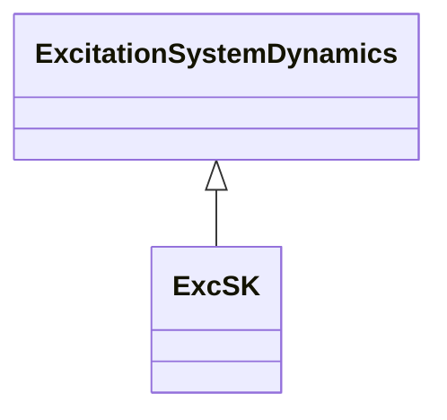

# ExcSK

Slovakian excitation system. UEL and secondary voltage control are included in this model. When this model is used, there cannot be a separate underexcitation limiter or VAr controller model.

## Inheritance

<button class="mermaid-enlarge-button">Enlarge Diagram</button>

## Attributes

| Label | Type | Multiplicity | Comment |
|-------|------|--------------|---------|
| efdmax | Float | 1..1 | Field voltage clipping upper level limit (Efdmax) (> ExcSK.efdmin). |
| efdmin | Float | 1..1 | Field voltage clipping lower level limit (Efdmin) (< ExcSK.efdmax). |
| emax | Float | 1..1 | Maximum field voltage output (Emax) (> ExcSK.emin). Typical value = 20. |
| emin | Float | 1..1 | Minimum field voltage output (Emin) (< ExcSK.emax). Typical value = -20. |
| k | Float | 1..1 | Gain (K). Typical value = 1. |
| k1 | Float | 1..1 | Parameter of underexcitation limit (K1). Typical value = 0,1364. |
| k2 | Float | 1..1 | Parameter of underexcitation limit (K2). Typical value = -0,3861. |
| kc | Float | 1..1 | PI controller gain (Kc). Typical value = 70. |
| kce | Float | 1..1 | Rectifier regulation factor (Kce). Typical value = 0. |
| kd | Float | 1..1 | Exciter internal reactance (Kd). Typical value = 0. |
| kgob | Float | 1..1 | P controller gain (Kgob). Typical value = 10. |
| kp | Float | 1..1 | PI controller gain (Kp). Typical value = 1. |
| kqi | Float | 1..1 | PI controller gain of integral component (Kqi). Typical value = 0. |
| kqob | Float | 1..1 | Rate of rise of the reactive power (Kqob). |
| kqp | Float | 1..1 | PI controller gain (Kqp). Typical value = 0. |
| nq | Float | 1..1 | Deadband of reactive power (nq). Determines the range of sensitivity. Typical value = 0,001. |
| qconoff | Boolean | 1..1 | Secondary voltage control state (Qc_on_off). true = secondary voltage control is on false = secondary voltage control is off. Typical value = false. |
| qz | Float | 1..1 | Desired value (setpoint) of reactive power, manual setting (Qz). |
| remote | Boolean | 1..1 | Selector to apply automatic calculation in secondary controller model (remote). true = automatic calculation is activated false = manual set is active; the use of desired value of reactive power (Qz) is required. Typical value = true. |
| sbase | Float | 1..1 | Apparent power of the unit (Sbase) (> 0). Unit = MVA. Typical value = 259. |
| tc | Float | 1..1 | PI controller phase lead time constant (Tc) (>= 0). Typical value = 8. |
| te | Float | 1..1 | Time constant of gain block (Te) (>= 0). Typical value = 0,1. |
| ti | Float | 1..1 | PI controller phase lead time constant (Ti) (>= 0). Typical value = 2. |
| tp | Float | 1..1 | Time constant (Tp) (>= 0). Typical value = 0,1. |
| tr | Float | 1..1 | Voltage transducer time constant (Tr) (>= 0). Typical value = 0,01. |
| uimax | Float | 1..1 | Maximum error (UImax) (> ExcSK.uimin). Typical value = 10. |
| uimin | Float | 1..1 | Minimum error (UImin) (< ExcSK.uimax). Typical value = -10. |
| urmax | Float | 1..1 | Maximum controller output (URmax) (> ExcSK.urmin). Typical value = 10. |
| urmin | Float | 1..1 | Minimum controller output (URmin) (< ExcSK.urmax). Typical value = -10. |
| vtmax | Float | 1..1 | Maximum terminal voltage input (Vtmax) (> ExcSK.vtmin). Determines the range of voltage deadband. Typical value = 1,05. |
| vtmin | Float | 1..1 | Minimum terminal voltage input (Vtmin) (< ExcSK.vtmax). Determines the range of voltage deadband. Typical value = 0,95. |
| yp | Float | 1..1 | Maximum output (Yp). Typical value = 1. |

