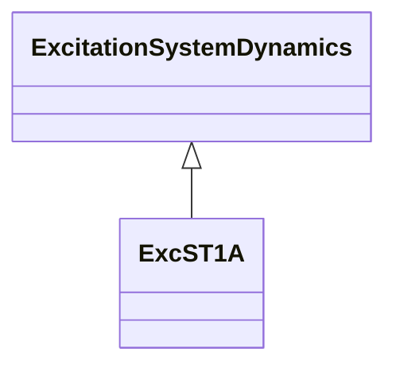

# ExcST1A

Modification of an old IEEE ST1A static excitation system without overexcitation limiter (OEL) and underexcitation limiter (UEL).

## Inheritance

<button class="mermaid-enlarge-button">Enlarge Diagram</button>

## Attributes

| Label | Type | Multiplicity | Comment |
|-------|------|--------------|---------|
| ilr | Float | 1..1 | Exciter output current limit reference (Ilr). Typical value = 0. |
| ka | Float | 1..1 | Voltage regulator gain (Ka) (> 0). Typical value = 190. |
| kc | Float | 1..1 | Rectifier loading factor proportional to commutating reactance (Kc) (>= 0). Typical value = 0,05. |
| kf | Float | 1..1 | Excitation control system stabilizer gains (Kf) (>= 0). Typical value = 0. |
| klr | Float | 1..1 | Exciter output current limiter gain (Klr). Typical value = 0. |
| ta | Float | 1..1 | Voltage regulator time constant (Ta) (>= 0). Typical value = 0,02. |
| tb | Float | 1..1 | Voltage regulator time constant (Tb) (>= 0). Typical value = 10. |
| tb1 | Float | 1..1 | Voltage regulator time constant (Tb1) (>= 0). Typical value = 0. |
| tc | Float | 1..1 | Voltage regulator time constant (Tc) (>= 0). Typical value = 1. |
| tc1 | Float | 1..1 | Voltage regulator time constant (Tc1) (>= 0). Typical value = 0. |
| tf | Float | 1..1 | Excitation control system stabilizer time constant (Tf) (>= 0). Typical value = 1. |
| vamax | Float | 1..1 | Maximum voltage regulator output (Vamax) (> 0). Typical value = 999. |
| vamin | Float | 1..1 | Minimum voltage regulator output (Vamin) (< 0). Typical value = -999. |
| vimax | Float | 1..1 | Maximum voltage regulator input limit (Vimax) (> 0). Typical value = 999. |
| vimin | Float | 1..1 | Minimum voltage regulator input limit (Vimin) (< 0). Typical value = -999. |
| vrmax | Float | 1..1 | Maximum voltage regulator outputs (Vrmax) (> 0) . Typical value = 7,8. |
| vrmin | Float | 1..1 | Minimum voltage regulator outputs (Vrmin) (< 0). Typical value = -6,7. |
| xe | Float | 1..1 | Excitation xfmr effective reactance (Xe). Typical value = 0,04. |

