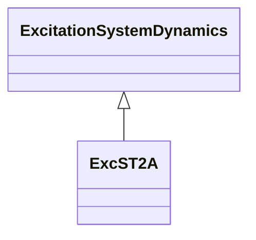

# ExcST2A

Modified IEEE ST2A static excitation system with another lead-lag block added to match the model defined by WECC.

## Inheritance

<button class="mermaid-enlarge-button">Enlarge Diagram</button>

## Attributes

| Label | Type | Multiplicity | Comment |
|-------|------|--------------|---------|
| efdmax | Float | 1..1 | Maximum field voltage (Efdmax) (>= 0). Typical value = 99. |
| ka | Float | 1..1 | Voltage regulator gain (Ka) (> 0). Typical value = 120. |
| kc | Float | 1..1 | Rectifier loading factor proportional to commutating reactance (Kc) (>= 0). Typical value = 1,82. |
| ke | Float | 1..1 | Exciter constant related to self-excited field (Ke). Typical value = 1. |
| kf | Float | 1..1 | Excitation control system stabilizer gains (kf) (>= 0). Typical value = 0,05. |
| ki | Float | 1..1 | Potential circuit gain coefficient (Ki) (>= 0). Typical value = 8. |
| kp | Float | 1..1 | Potential circuit gain coefficient (Kp) (>= 0). Typical value = 4,88. |
| ta | Float | 1..1 | Voltage regulator time constant (Ta) (> 0). Typical value = 0,15. |
| tb | Float | 1..1 | Voltage regulator time constant (Tb) (>= 0). Typical value = 0. |
| tc | Float | 1..1 | Voltage regulator time constant (Tc) (>= 0). Typical value = 0. |
| te | Float | 1..1 | Exciter time constant, integration rate associated with exciter control (Te) (> 0). Typical value = 0,5. |
| tf | Float | 1..1 | Excitation control system stabilizer time constant (Tf) (>= 0). Typical value = 0,7. |
| uelin | Boolean | 1..1 | UEL input (UELin). true = HV gate false = add to error signal. Typical value = false. |
| vrmax | Float | 1..1 | Maximum voltage regulator outputs (Vrmax) (> 0). Typical value = 1. |
| vrmin | Float | 1..1 | Minimum voltage regulator outputs (Vrmin) (< 0). Typical value = -1. |

