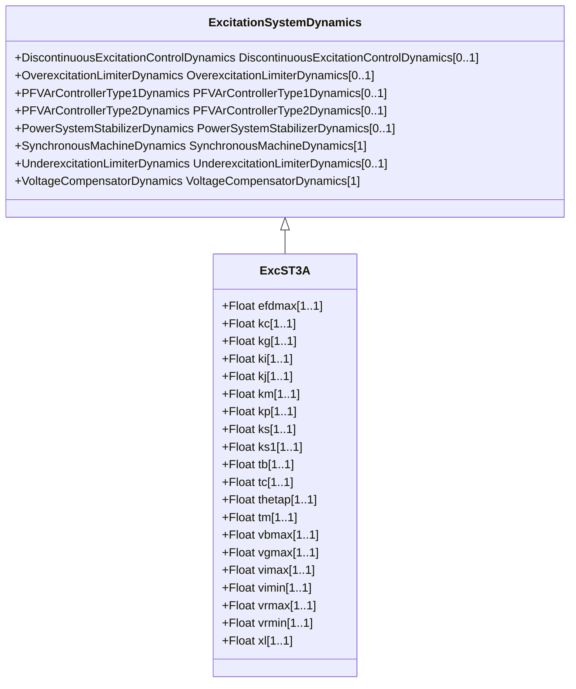

# ExcST3A

Modified IEEE ST3A static excitation system with added speed multiplier.

## Inheritance

<button class="mermaid-enlarge-button">Enlarge Diagram</button>

## Attributes

| Label | Type | Multiplicity | Comment |
|-------|------|--------------|---------|
| efdmax | Float | 1..1 | Maximum AVR output (Efdmax) (>= 0). Typical value = 6,9. |
| kc | Float | 1..1 | Rectifier loading factor proportional to commutating reactance (Kc) (>= 0). Typical value = 1,1. |
| kg | Float | 1..1 | Feedback gain constant of the inner loop field regulator (Kg) (>= 0). Typical value = 1. |
| ki | Float | 1..1 | Potential circuit gain coefficient (Ki) (>= 0). Typical value = 4,83. |
| kj | Float | 1..1 | AVR gain (Kj) (> 0). Typical value = 200. |
| km | Float | 1..1 | Forward gain constant of the inner loop field regulator (Km) (> 0). Typical value = 7,04. |
| kp | Float | 1..1 | Potential source gain (Kp) (> 0). Typical value = 4,37. |
| ks | Float | 1..1 | Coefficient to allow different usage of the model-speed coefficient (Ks). Typical value = 0. |
| ks1 | Float | 1..1 | Coefficient to allow different usage of the model-speed coefficient (Ks1). Typical value = 0. |
| tb | Float | 1..1 | Voltage regulator time constant (Tb) (>= 0). Typical value = 6,67. |
| tc | Float | 1..1 | Voltage regulator time constant (Tc) (>= 0). Typical value = 1. |
| thetap | Float | 1..1 | Potential circuit phase angle (thetap). Typical value = 20. |
| tm | Float | 1..1 | Forward time constant of inner loop field regulator (Tm) (> 0). Typical value = 1. |
| vbmax | Float | 1..1 | Maximum excitation voltage (Vbmax) (> 0). Typical value = 8,63. |
| vgmax | Float | 1..1 | Maximum inner loop feedback voltage (Vgmax) (>= 0). Typical value = 6,53. |
| vimax | Float | 1..1 | Maximum voltage regulator input limit (Vimax) (> 0). Typical value = 0,2. |
| vimin | Float | 1..1 | Minimum voltage regulator input limit (Vimin) (< 0). Typical value = -0,2. |
| vrmax | Float | 1..1 | Maximum voltage regulator output (Vrmax) (> 0). Typical value = 1. |
| vrmin | Float | 1..1 | Minimum voltage regulator output (Vrmin) (< 0). Typical value = -1. |
| xl | Float | 1..1 | Reactance associated with potential source (Xl) (>= 0). Typical value = 0,09. |

