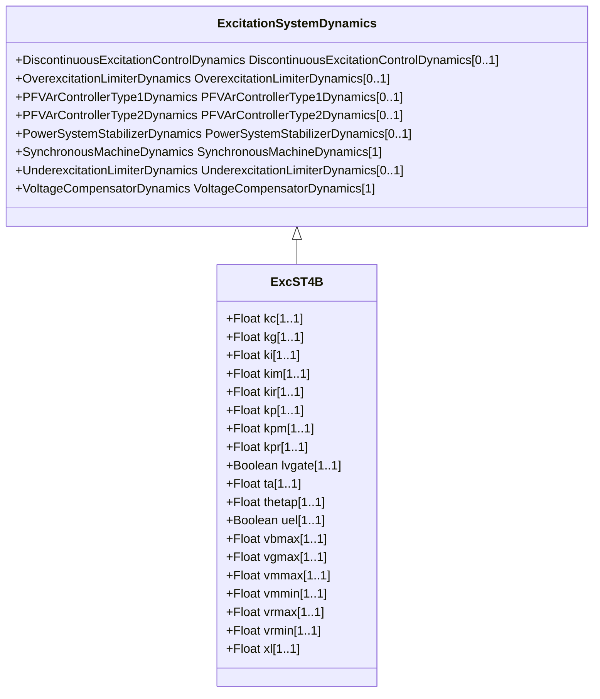

# ExcST4B

Modified IEEE ST4B static excitation system with maximum inner loop feedback gain Vgmax.

## Inheritance

<button class="mermaid-enlarge-button">Enlarge Diagram</button>

## Attributes

| Label | Type | Multiplicity | Comment |
|-------|------|--------------|---------|
| kc | Float | 1..1 | Rectifier loading factor proportional to commutating reactance (Kc) (>= 0). Typical value = 0,113. |
| kg | Float | 1..1 | Feedback gain constant of the inner loop field regulator (Kg) (>= 0). Typical value = 0. |
| ki | Float | 1..1 | Potential circuit gain coefficient (Ki) (>= 0). Typical value = 0. |
| kim | Float | 1..1 | Voltage regulator integral gain output (Kim). Typical value = 0. |
| kir | Float | 1..1 | Voltage regulator integral gain (Kir). Typical value = 10,75. |
| kp | Float | 1..1 | Potential circuit gain coefficient (Kp) (> 0). Typical value = 9,3. |
| kpm | Float | 1..1 | Voltage regulator proportional gain output (Kpm). Typical value = 1. |
| kpr | Float | 1..1 | Voltage regulator proportional gain (Kpr). Typical value = 10,75. |
| lvgate | Boolean | 1..1 | Selector (LVGate). true = LVGate is part of the block diagram false = LVGate is not part of the block diagram. Typical value = false. |
| ta | Float | 1..1 | Voltage regulator time constant (Ta) (>= 0). Typical value = 0,02. |
| thetap | Float | 1..1 | Potential circuit phase angle (thetap). Typical value = 0. |
| uel | Boolean | 1..1 | Selector (UEL). true = UEL is part of block diagram false = UEL is not part of block diagram. Typical value = false. |
| vbmax | Float | 1..1 | Maximum excitation voltage (Vbmax) (> 0). Typical value = 11,63. |
| vgmax | Float | 1..1 | Maximum inner loop feedback voltage (Vgmax) (>= 0). Typical value = 5,8. |
| vmmax | Float | 1..1 | Maximum inner loop output (Vmmax) (> ExcST4B.vmmin). Typical value = 99. |
| vmmin | Float | 1..1 | Minimum inner loop output (Vmmin) (< ExcST4B.vmmax). Typical value = -99. |
| vrmax | Float | 1..1 | Maximum voltage regulator output (Vrmax) (> 0). Typical value = 1. |
| vrmin | Float | 1..1 | Minimum voltage regulator output (Vrmin) (< 0). Typical value = -0,87. |
| xl | Float | 1..1 | Reactance associated with potential source (Xl) (>= 0). Typical value = 0,124. |

