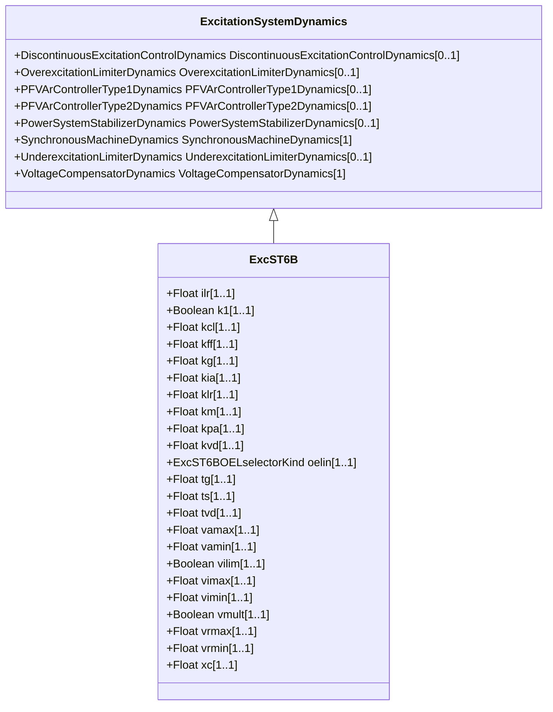

# ExcST6B

Modified IEEE ST6B static excitation system with PID controller and optional inner feedback loop.

## Inheritance

<button class="mermaid-enlarge-button">Enlarge Diagram</button>

## Attributes

| Label | Type | Multiplicity | Comment |
|-------|------|--------------|---------|
| ilr | Float | 1..1 | Exciter output current limit reference (Ilr) (> 0). Typical value = 4,164. |
| k1 | Boolean | 1..1 | Selector (K1). true = feedback is from Ifd false = feedback is not from Ifd. Typical value = true. |
| kcl | Float | 1..1 | Exciter output current limit adjustment (Kcl) (> 0). Typical value = 1,0577. |
| kff | Float | 1..1 | Pre-control gain constant of the inner loop field regulator (Kff). Typical value = 1. |
| kg | Float | 1..1 | Feedback gain constant of the inner loop field regulator (Kg) (>= 0). Typical value = 1. |
| kia | Float | 1..1 | Voltage regulator integral gain (Kia) (> 0). Typical value = 45,094. |
| klr | Float | 1..1 | Exciter output current limit adjustment (Kcl) (> 0). Typical value = 17,33. |
| km | Float | 1..1 | Forward gain constant of the inner loop field regulator (Km). Typical value = 1. |
| kpa | Float | 1..1 | Voltage regulator proportional gain (Kpa) (> 0). Typical value = 18,038. |
| kvd | Float | 1..1 | Voltage regulator derivative gain (Kvd). Typical value = 0. |
| oelin | [ExcST6BOELselectorKind](ExcST6BOELselectorKind.md) | 1..1 | OEL input selector (OELin). Typical value = noOELinput (corresponds to OELin = 0 on diagram). |
| tg | Float | 1..1 | Feedback time constant of inner loop field voltage regulator (Tg) (>= 0). Typical value = 0,02. |
| ts | Float | 1..1 | Rectifier firing time constant (Ts) (>= 0). Typical value = 0. |
| tvd | Float | 1..1 | Voltage regulator derivative gain (Tvd) (>= 0). Typical value = 0. |
| vamax | Float | 1..1 | Maximum voltage regulator output (Vamax) (> 0). Typical value = 4,81. |
| vamin | Float | 1..1 | Minimum voltage regulator output (Vamin) (< 0). Typical value = -3,85. |
| vilim | Boolean | 1..1 | Selector (Vilim). true = Vimin-Vimax limiter is active false = Vimin-Vimax limiter is not active. Typical value = true. |
| vimax | Float | 1..1 | Maximum voltage regulator input limit (Vimax) (> ExcST6B.vimin). Typical value = 10. |
| vimin | Float | 1..1 | Minimum voltage regulator input limit (Vimin) (< ExcST6B.vimax). Typical value = -10. |
| vmult | Boolean | 1..1 | Selector (vmult). true = multiply regulator output by terminal voltage false = do not multiply regulator output by terminal voltage. Typical value = true. |
| vrmax | Float | 1..1 | Maximum voltage regulator output (Vrmax) (> 0). Typical value = 4,81. |
| vrmin | Float | 1..1 | Minimum voltage regulator output (Vrmin) (< 0). Typical value = -3,85. |
| xc | Float | 1..1 | Excitation source reactance (Xc). Typical value = 0,05. |

