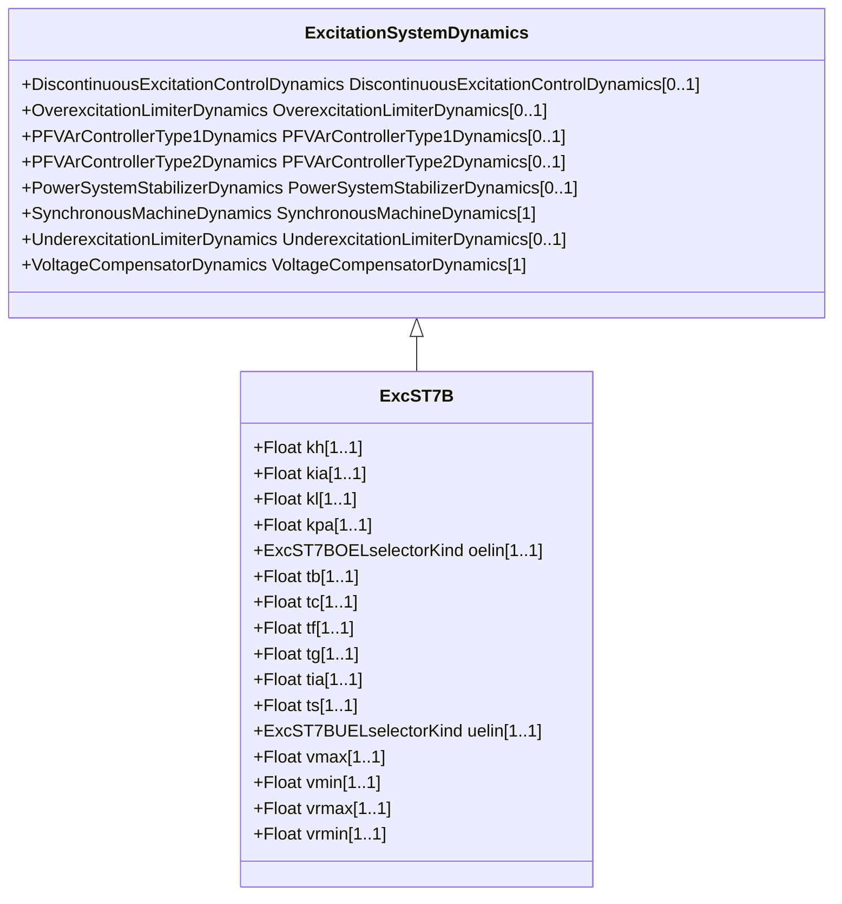

# ExcST7B

Modified IEEE ST7B static excitation system without stator current limiter (SCL) and current compensator (DROOP) inputs.

## Inheritance

<button class="mermaid-enlarge-button">Enlarge Diagram</button>

## Attributes

| Label | Type | Multiplicity | Comment |
|-------|------|--------------|---------|
| kh | Float | 1..1 | High-value gate feedback gain (Kh) (>= 0). Typical value = 1. |
| kia | Float | 1..1 | Voltage regulator integral gain (Kia) (>= 0). Typical value = 1. |
| kl | Float | 1..1 | Low-value gate feedback gain (Kl) (>= 0). Typical value = 1. |
| kpa | Float | 1..1 | Voltage regulator proportional gain (Kpa) (> 0). Typical value = 40. |
| oelin | [ExcST7BOELselectorKind](ExcST7BOELselectorKind.md) | 1..1 | OEL input selector (OELin). Typical value = noOELinput. |
| tb | Float | 1..1 | Regulator lag time constant (Tb) (>= 0). Typical value = 1. |
| tc | Float | 1..1 | Regulator lead time constant (Tc) (>= 0). Typical value = 1. |
| tf | Float | 1..1 | Excitation control system stabilizer time constant (Tf) (>= 0). Typical value = 1. |
| tg | Float | 1..1 | Feedback time constant of inner loop field voltage regulator (Tg) (>= 0). Typical value = 1. |
| tia | Float | 1..1 | Feedback time constant (Tia) (>= 0). Typical value = 3. |
| ts | Float | 1..1 | Rectifier firing time constant (Ts) (>= 0). Typical value = 0. |
| uelin | [ExcST7BUELselectorKind](ExcST7BUELselectorKind.md) | 1..1 | UEL input selector (UELin). Typical value = noUELinput. |
| vmax | Float | 1..1 | Maximum voltage reference signal (Vmax) (> 0 and > ExcST7B.vmin)). Typical value = 1,1. |
| vmin | Float | 1..1 | Minimum voltage reference signal (Vmin) (> 0 and < ExcST7B.vmax). Typical value = 0,9. |
| vrmax | Float | 1..1 | Maximum voltage regulator output (Vrmax) (> 0). Typical value = 5. |
| vrmin | Float | 1..1 | Minimum voltage regulator output (Vrmin) (< 0). Typical value = -4,5. |

