# ExcitationSystemDynamics

Excitation system function block whose behaviour is described by reference to a standard model or by definition of a user-defined model.

## Inheritance

```mermaid
classDiagram
    DynamicsFunctionBlock <|-- ExcitationSystemDynamics
    ExcitationSystemDynamics <|-- ExcSEXS
    ExcitationSystemDynamics <|-- ExcST6B
    ExcitationSystemDynamics <|-- ExcOEX3T
    ExcitationSystemDynamics <|-- ExcAVR1
    ExcitationSystemDynamics <|-- ExcIEEEST2A
    ExcitationSystemDynamics <|-- ExcAC1A
    ExcitationSystemDynamics <|-- ExcIEEEDC2A
    ExcitationSystemDynamics <|-- ExcIEEEST3A
    ExcitationSystemDynamics <|-- ExcST7B
    ExcitationSystemDynamics <|-- ExcDC3A
    ExcitationSystemDynamics <|-- ExcPIC
    ExcitationSystemDynamics <|-- ExcIEEEAC5A
    ExcitationSystemDynamics <|-- ExcREXS
    ExcitationSystemDynamics <|-- ExcIEEEDC3A
    ExcitationSystemDynamics <|-- ExcAC3A
    ExcitationSystemDynamics <|-- ExcAVR3
    ExcitationSystemDynamics <|-- ExcAC4A
    ExcitationSystemDynamics <|-- ExcIEEEST6B
    ExcitationSystemDynamics <|-- ExcSK
    ExcitationSystemDynamics <|-- ExcIEEEST7B
    ExcitationSystemDynamics <|-- ExcHU
    ExcitationSystemDynamics <|-- ExcST3A
    ExcitationSystemDynamics <|-- ExcDC3A1
    ExcitationSystemDynamics <|-- ExcIEEEAC7B
    ExcitationSystemDynamics <|-- ExcNI
    ExcitationSystemDynamics <|-- ExcIEEEST5B
    ExcitationSystemDynamics <|-- ExcRQB
    ExcitationSystemDynamics <|-- ExcIEEEAC8B
    ExcitationSystemDynamics <|-- ExcAVR4
    ExcitationSystemDynamics <|-- ExcAVR5
    ExcitationSystemDynamics <|-- ExcAC5A
    ExcitationSystemDynamics <|-- ExcAC8B
    ExcitationSystemDynamics <|-- ExcIEEEST1A
    ExcitationSystemDynamics <|-- ExcBBC
    ExcitationSystemDynamics <|-- ExcST2A
    ExcitationSystemDynamics <|-- ExcIEEEAC3A
    ExcitationSystemDynamics <|-- ExcCZ
    ExcitationSystemDynamics <|-- ExcANS
    ExcitationSystemDynamics <|-- ExcIEEEDC4B
    ExcitationSystemDynamics <|-- ExcAVR2
    ExcitationSystemDynamics <|-- ExcELIN1
    ExcitationSystemDynamics <|-- ExcSCRX
    ExcitationSystemDynamics <|-- ExcAC6A
    ExcitationSystemDynamics <|-- ExcIEEEDC1A
    ExcitationSystemDynamics <|-- ExcAC2A
    ExcitationSystemDynamics <|-- ExcDC2A
    ExcitationSystemDynamics <|-- ExcIEEEST4B
    ExcitationSystemDynamics <|-- ExcDC1A
    ExcitationSystemDynamics <|-- ExcAVR7
    ExcitationSystemDynamics <|-- ExcIEEEAC6A
    ExcitationSystemDynamics <|-- ExcST1A
    ExcitationSystemDynamics <|-- ExcST4B
    ExcitationSystemDynamics <|-- ExcELIN2
    ExcitationSystemDynamics <|-- ExcitationSystemUserDefined
    ExcitationSystemDynamics <|-- ExcIEEEAC2A
    ExcitationSystemDynamics <|-- ExcIEEEAC4A
    ExcitationSystemDynamics <|-- ExcIEEEAC1A
```

<button class="mermaid-enlarge-button">Enlarge Diagram</button>

## Attributes

| Label | Type | Multiplicity | Comment |
|-------|------|--------------|---------|
| DiscontinuousExcitationControlDynamics | [DiscontinuousExcitationControlDynamics](DiscontinuousExcitationControlDynamics.md) | 0..1 | Discontinuous excitation control model associated with this excitation system model. |
| OverexcitationLimiterDynamics | [OverexcitationLimiterDynamics](OverexcitationLimiterDynamics.md) | 0..1 | Overexcitation limiter model associated with this excitation system model. |
| PFVArControllerType1Dynamics | [PFVArControllerType1Dynamics](PFVArControllerType1Dynamics.md) | 0..1 | Power factor or VAr controller type 1 model associated with this excitation system model. |
| PFVArControllerType2Dynamics | [PFVArControllerType2Dynamics](PFVArControllerType2Dynamics.md) | 0..1 | Power factor or VAr controller type 2 model associated with this excitation system model. |
| PowerSystemStabilizerDynamics | [PowerSystemStabilizerDynamics](PowerSystemStabilizerDynamics.md) | 0..1 | Power system stabilizer model associated with this excitation system model. |
| SynchronousMachineDynamics | [SynchronousMachineDynamics](SynchronousMachineDynamics.md) | 1 | Synchronous machine model with which this excitation system model is associated. |
| UnderexcitationLimiterDynamics | [UnderexcitationLimiterDynamics](UnderexcitationLimiterDynamics.md) | 0..1 | Undrexcitation limiter model associated with this excitation system model. |
| VoltageCompensatorDynamics | [VoltageCompensatorDynamics](VoltageCompensatorDynamics.md) | 1 | Voltage compensator model associated with this excitation system model. |

