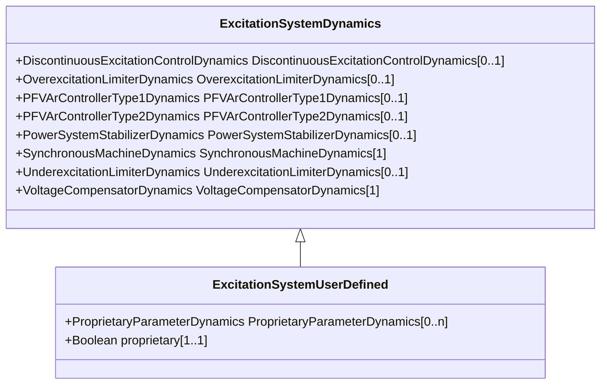

# ExcitationSystemUserDefined

Excitation system function block whose dynamic behaviour is described by a user-defined model.

## Inheritance

<button class="mermaid-enlarge-button">Enlarge Diagram</button>

## Attributes

| Label | Type | Multiplicity | Comment |
|-------|------|--------------|---------|
| ProprietaryParameterDynamics | [ProprietaryParameterDynamics](ProprietaryParameterDynamics.md) | 0..n | Parameter of this proprietary user-defined model. |
| proprietary | Boolean | 1..1 | Behaviour is based on a proprietary model as opposed to a detailed model. true = user-defined model is proprietary with behaviour mutually understood by sending and receiving applications and parameters passed as general attributes false = user-defined model is explicitly defined in terms of control blocks and their input and output signals. |

