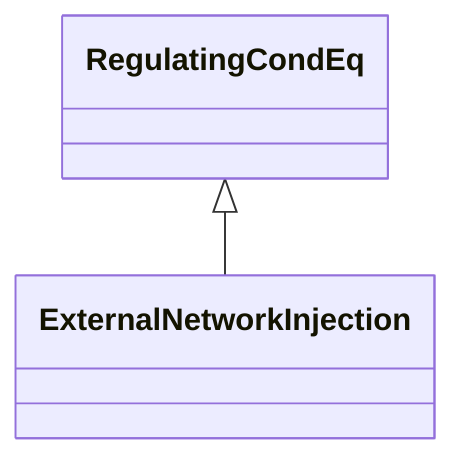

# ExternalNetworkInjection

This class represents the external network and it is used for IEC 60909 calculations.

## Inheritance

<button class="mermaid-enlarge-button">Enlarge Diagram</button>

## Attributes

| Label | Type | Multiplicity | Comment |
|-------|------|--------------|---------|
| governorSCD | Float | 1..1 | Power Frequency Bias. This is the change in power injection divided by the change in frequency and negated. A positive value of the power frequency bias provides additional power injection upon a drop in frequency. |
| ikSecond | Boolean | 0..1 | Indicates whether initial symmetrical short-circuit current and power have been calculated according to IEC (Ik'). Used only if short circuit calculations are done according to superposition method. |
| maxInitialSymShCCurrent | Float | 1..1 | Maximum initial symmetrical short-circuit currents (Ik' max) in A (Ik' = Sk'/(SQRT(3) Un)). Used for short circuit data exchange according to IEC 60909. |
| maxP | Float | 1..1 | Maximum active power of the injection. |
| maxQ | Float | 1..1 | Maximum reactive power limit. It is used for modelling of infeed for load flow exchange and not for short circuit modelling. |
| maxR0ToX0Ratio | Float | 1..1 | Maximum ratio of zero sequence resistance of Network Feeder to its zero sequence reactance (R(0)/X(0) max). Used for short circuit data exchange according to IEC 60909. |
| maxR1ToX1Ratio | Float | 1..1 | Maximum ratio of positive sequence resistance of Network Feeder to its positive sequence reactance (R(1)/X(1) max). Used for short circuit data exchange according to IEC 60909. |
| maxZ0ToZ1Ratio | Float | 1..1 | Maximum ratio of zero sequence impedance to its positive sequence impedance (Z(0)/Z(1) max). Used for short circuit data exchange according to IEC 60909. |
| minInitialSymShCCurrent | Float | 1..1 | Minimum initial symmetrical short-circuit currents (Ik' min) in A (Ik' = Sk'/(SQRT(3) Un)). Used for short circuit data exchange according to IEC 60909. |
| minP | Float | 1..1 | Minimum active power of the injection. |
| minQ | Float | 1..1 | Minimum reactive power limit. It is used for modelling of infeed for load flow exchange and not for short circuit modelling. |
| minR0ToX0Ratio | Float | 1..1 | Indicates whether initial symmetrical short-circuit current and power have been calculated according to IEC (Ik'). Used for short circuit data exchange according to IEC 6090. |
| minR1ToX1Ratio | Float | 1..1 | Minimum ratio of positive sequence resistance of Network Feeder to its positive sequence reactance (R(1)/X(1) min). Used for short circuit data exchange according to IEC 60909. |
| minZ0ToZ1Ratio | Float | 1..1 | Minimum ratio of zero sequence impedance to its positive sequence impedance (Z(0)/Z(1) min). Used for short circuit data exchange according to IEC 60909. |
| p | Float | 1..1 | Active power injection. Load sign convention is used, i.e. positive sign means flow out from a node. Starting value for steady state solutions. |
| q | Float | 1..1 | Reactive power injection. Load sign convention is used, i.e. positive sign means flow out from a node. Starting value for steady state solutions. |
| referencePriority | Integer | 1..1 | Priority of unit for use as powerflow voltage phase angle reference bus selection. 0 = don t care (default) 1 = highest priority. 2 is less than 1 and so on. |
| voltageFactor | Float | 0..1 | Voltage factor in pu, which was used to calculate short-circuit current Ik' and power Sk'. Used only if short circuit calculations are done according to superposition method. |

