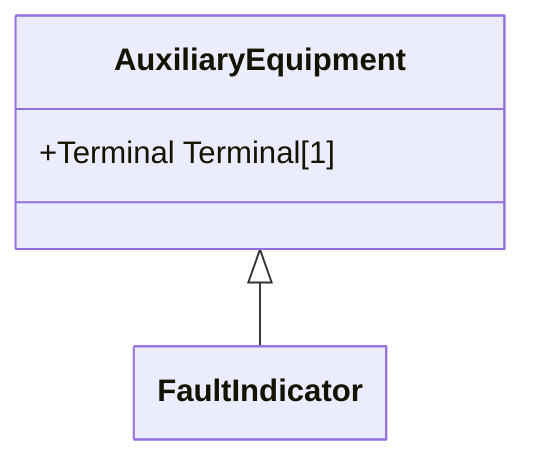

# FaultIndicator

A FaultIndicator is typically only an indicator (which may or may not be remotely monitored), and not a piece of equipment that actually initiates a protection event. It is used for FLISR (Fault Location, Isolation and Restoration) purposes, assisting with the dispatch of crews to 'most likely' part of the network (i.e. assists with determining circuit section where the fault most likely happened).

## Inheritance

<button class="mermaid-enlarge-button">Enlarge Diagram</button>

## Attributes

| Label | Type | Multiplicity | Comment |
|-------|------|--------------|---------|
| No attributes | | | |

