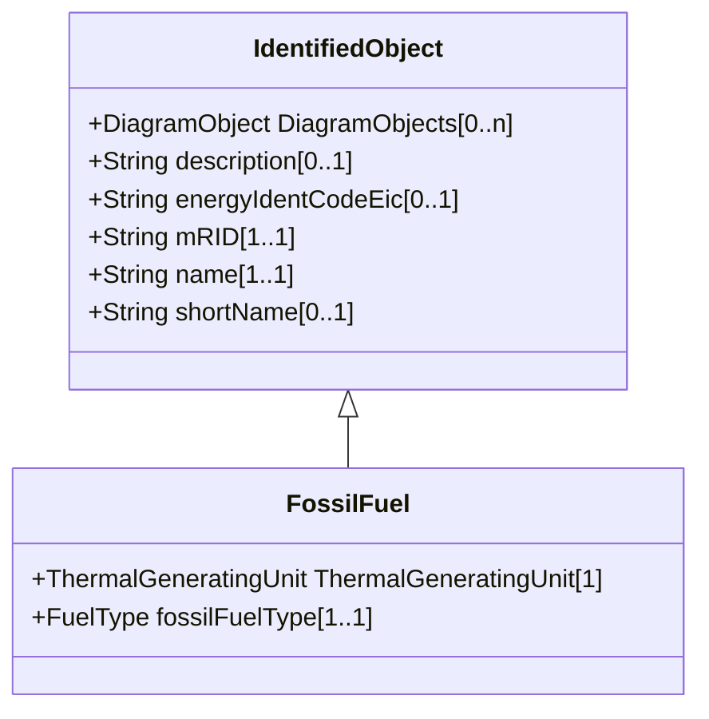

# FossilFuel

The fossil fuel consumed by the non-nuclear thermal generating unit. For example, coal, oil, gas, etc. These are the specific fuels that the generating unit can consume.

## Inheritance

<button class="mermaid-enlarge-button">Enlarge Diagram</button>

## Attributes

| Label | Type | Multiplicity | Comment |
|-------|------|--------------|---------|
| ThermalGeneratingUnit | [ThermalGeneratingUnit](ThermalGeneratingUnit.md) | 1 | A thermal generating unit may have one or more fossil fuels. |
| fossilFuelType | [FuelType](FuelType.md) | 1..1 | The type of fossil fuel, such as coal, oil, or gas. |

