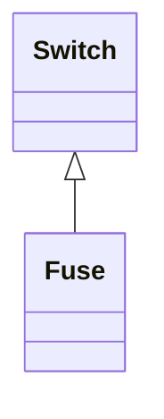

# Fuse

An overcurrent protective device with a circuit opening fusible part that is heated and severed by the passage of overcurrent through it. A fuse is considered a switching device because it breaks current.

## Inheritance

<button class="mermaid-enlarge-button">Enlarge Diagram</button>

## Attributes

| Label | Type | Multiplicity | Comment |
|-------|------|--------------|---------|
| No attributes | | | |

