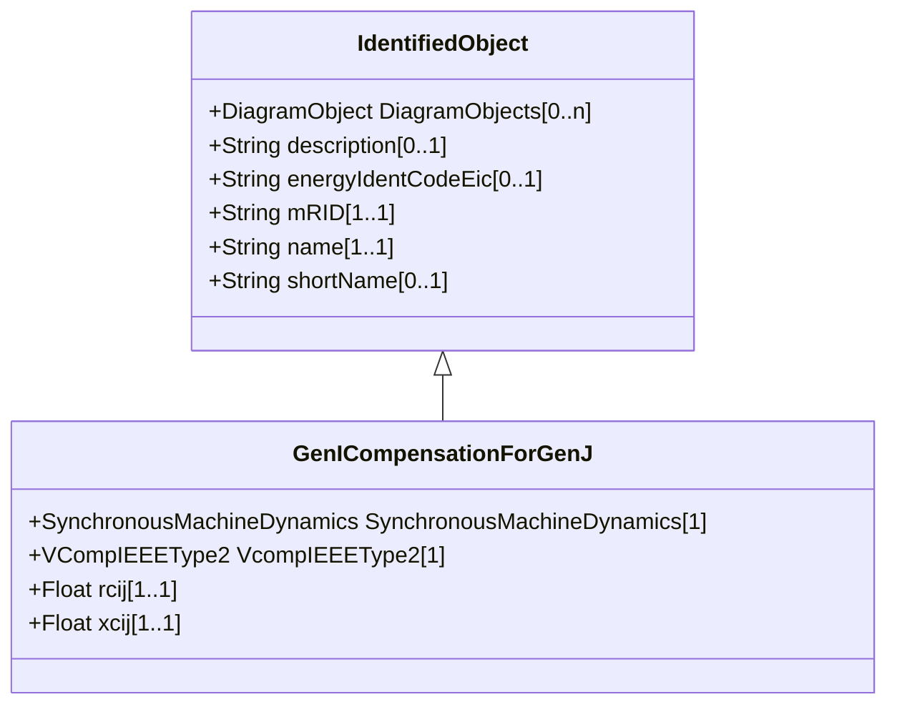

# GenICompensationForGenJ

Resistive and reactive components of compensation for generator associated with IEEE type 2 voltage compensator for current flow out of another generator in the interconnection.

## Inheritance

<button class="mermaid-enlarge-button">Enlarge Diagram</button>

## Attributes

| Label | Type | Multiplicity | Comment |
|-------|------|--------------|---------|
| SynchronousMachineDynamics | [SynchronousMachineDynamics](SynchronousMachineDynamics.md) | 1 | Standard synchronous machine out of which current flow is being compensated for. |
| VcompIEEEType2 | [VCompIEEEType2](VCompIEEEType2.md) | 1 | The standard IEEE type 2 voltage compensator of this compensation. |
| rcij | Float | 1..1 | Resistive component of compensation of generator associated with this IEEE type 2 voltage compensator for current flow out of another generator (Rcij). |
| xcij | Float | 1..1 | Reactive component of compensation of generator associated with this IEEE type 2 voltage compensator for current flow out of another generator (Xcij). |

