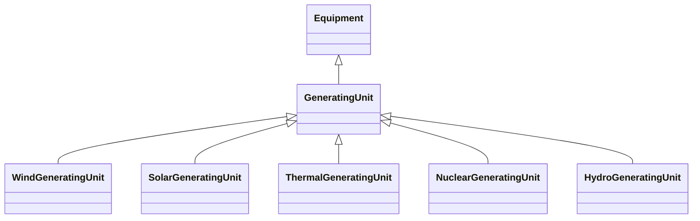

# GeneratingUnit

A single or set of synchronous machines for converting mechanical power into alternating-current power. For example, individual machines within a set may be defined for scheduling purposes while a single control signal is derived for the set. In this case there would be a GeneratingUnit for each member of the set and an additional GeneratingUnit corresponding to the set.

## Inheritance

<button class="mermaid-enlarge-button">Enlarge Diagram</button>

## Attributes

| Label | Type | Multiplicity | Comment |
|-------|------|--------------|---------|
| ControlAreaGeneratingUnit | [ControlAreaGeneratingUnit](ControlAreaGeneratingUnit.md) | 0..n | ControlArea specifications for this generating unit. |
| GrossToNetActivePowerCurves | [GrossToNetActivePowerCurve](GrossToNetActivePowerCurve.md) | 0..n | A generating unit may have a gross active power to net active power curve, describing the losses and auxiliary power requirements of the unit. |
| RotatingMachine | [RotatingMachine](RotatingMachine.md) | 1..n | A synchronous machine may operate as a generator and as such becomes a member of a generating unit. |
| genControlSource | [GeneratorControlSource](GeneratorControlSource.md) | 0..1 | The source of controls for a generating unit. Defines the control status of the generating unit. |
| governorSCD | Float | 0..1 | Governor Speed Changer Droop. This is the change in generator power output divided by the change in frequency normalized by the nominal power of the generator and the nominal frequency and expressed in percent and negated. A positive value of speed change droop provides additional generator output upon a drop in frequency. |
| longPF | Float | 0..1 | Generating unit long term economic participation factor. |
| maxOperatingP | Float | 1..1 | This is the maximum operating active power limit the dispatcher can enter for this unit. |
| maximumAllowableSpinningReserve | Float | 0..1 | Maximum allowable spinning reserve. Spinning reserve will never be considered greater than this value regardless of the current operating point. |
| minOperatingP | Float | 1..1 | This is the minimum operating active power limit the dispatcher can enter for this unit. |
| nominalP | Float | 0..1 | The nominal power of the generating unit. Used to give precise meaning to percentage based attributes such as the governor speed change droop (governorSCD attribute). The attribute shall be a positive value equal to or less than RotatingMachine.ratedS. |
| normalPF | Float | 1..1 | Generating unit economic participation factor. The sum of the participation factors across generating units does not have to sum to one. It is used for representing distributed slack participation factor. The attribute shall be a positive value or zero. |
| ratedGrossMaxP | Float | 0..1 | The unit's gross rated maximum capacity (book value). The attribute shall be a positive value. |
| ratedGrossMinP | Float | 0..1 | The gross rated minimum generation level which the unit can safely operate at while delivering power to the transmission grid. The attribute shall be a positive value. |
| ratedNetMaxP | Float | 0..1 | The net rated maximum capacity determined by subtracting the auxiliary power used to operate the internal plant machinery from the rated gross maximum capacity. The attribute shall be a positive value. |
| shortPF | Float | 0..1 | Generating unit short term economic participation factor. |
| startupCost | Float | 0..1 | The initial startup cost incurred for each start of the GeneratingUnit. |
| startupTime | Float | 0..1 | Time it takes to get the unit on-line, from the time that the prime mover mechanical power is applied. |
| totalEfficiency | Float | 0..1 | The efficiency of the unit in converting the fuel into electrical energy. |
| variableCost | Float | 0..1 | The variable cost component of production per unit of ActivePower. |

