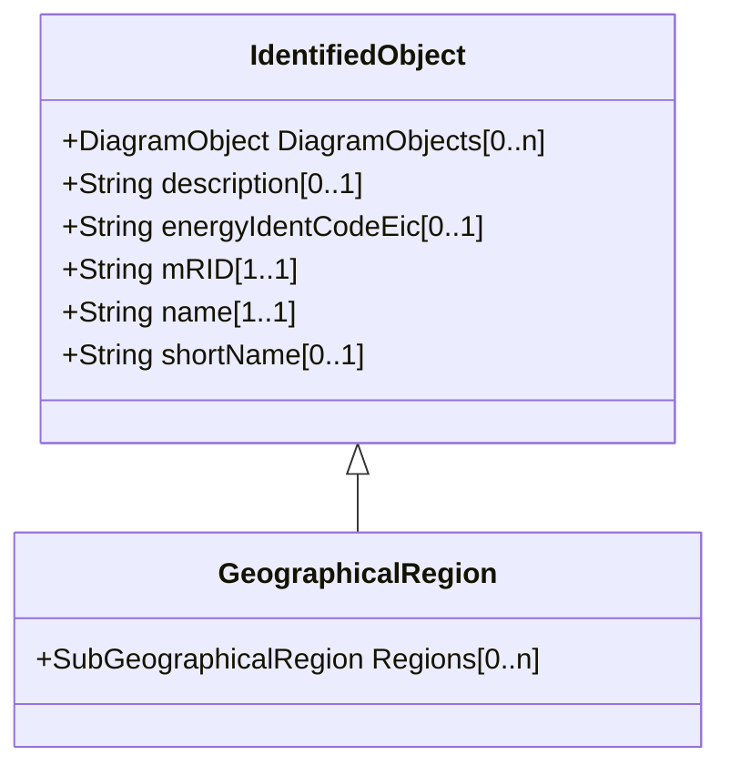

# GeographicalRegion

A geographical region of a power system network model.

## Inheritance

<button class="mermaid-enlarge-button">Enlarge Diagram</button>

## Attributes

| Label | Type | Multiplicity | Comment |
|-------|------|--------------|---------|
| Regions | [SubGeographicalRegion](SubGeographicalRegion.md) | 0..n | All sub-geographical regions within this geographical region. |

